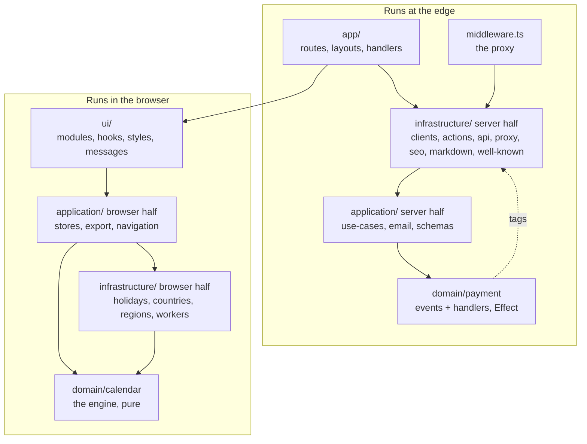

The [overview](/architecture/overview/) measures the dependency graph; this page walks each node of it. Every layer carries a `CLAUDE.md` at its root that is the binding contract; this page is the tour, and it links the contract rather than restating it where the contract is long.

The split that matters most is not between layers but between **runtimes**: two of the five layers have a server half and a browser half that share almost nothing. The planner runs in the browser ([ADR 0001](https://github.com/fbuireu/forever-pto/blob/main/adr/0001-planner-runs-in-the-browser.md)), so the product's weight sits on the right of the diagram, and the server side is a Donation, a session, a contact form and some static rendering.

## `app/`: the App Router shell

**What it holds.** Every URL the app answers and the file-convention entry points Next discovers by name: `[locale]/layout.tsx` (the only file that renders `<html>` on the normal path), the `(marketing)` and `(app)` route groups, `api/` route handlers, the `.well-known/[...slug]` catch-all, `fonts.ts`, `sitemap.ts`, `robots.ts` and the two global boundaries. The [routing](/architecture/routing/) page has the tree.

**What it may import.** `@ui/*` to compose pages, `@application/use-cases/*` and `@infrastructure/*` to terminate a server flow. It never imports `@domain/*`: the overview's table has that cell empty, and it is the layering claim the package keeps. A route handler reaches a business rule through a use case or through the calculations worker, never directly.

**The rules.**

- **A page is composition.** It renders modules from `@ui/modules/*` and passes `locale` down; the planner page `dynamic()`-imports its seven sections and nothing else. Business logic that lands here is in the wrong layer.
- **A route handler is a terminator.** It parses the request, runs an Effect program against `ApplicationLayer`, maps the typed failure channel onto a status through `describeFailure`, and closes the tail with `catchAll` so it never rejects. Where a flow exists behind more than one transport (a route *and* a server action), the handler calls an operation under `apps/web/src/infrastructure/api/operations/` and wraps its outcome; see the [rate limiting](/how-it-works/rate-limiting/) page for what that seam owns.
- **Metadata is one line per route.** `export const generateMetadata = routeMetadata('/legal/privacy-policy')`, reading the route's own row of `SITE_ROUTES`; the shape, the hreflang map and the indexability rule live in `apps/web/src/infrastructure/seo/buildMetadata.ts` ([SEO](/how-it-works/seo/)).
- **Bodies are parsed inside the program.** `parseJsonBody` lifts `request.json()` into the Effect so a malformed body is a `ValidationError` and a 400, not a bare 500 from a rejection before any `catchTags` exists. The Stripe webhook is the exception: it needs the raw text for signature verification.
- **Anything carrying Premium state answers `no-store`.** `check-session` and `health` go through `noStore`, and the tests assert the header against the real helper rather than a mock.
- **Security headers are not here.** They are `SECURITY_HEADERS` in `next.config.ts`, applied to `/(.*)`, which, unlike the proxy's matcher, covers every request.

**Where a change goes.** A new page is a folder with `page.tsx` and one `generateMetadata` line, plus a row in `SITE_ROUTES`. A new endpoint is a route handler that terminates a use case, and an operation the moment a second transport needs the same flow.

## `middleware.ts`: the proxy

Not a layer but a single file at the root of `src`, kept at the pre-Next-16 name deliberately: the name is what selects the edge runtime, and OpenNext's Node middleware bundling loses the header edits this chain makes ([ADR 0009](https://github.com/fbuireu/forever-pto/blob/main/adr/0009-next-16-2-pinned-by-the-cloudflare-adapter.md)). It imports only `@infrastructure/*` (five edges in the measured graph) and is a table of contents: Markdown negotiation, the payment-confirmation guard, locale resolution, the locale cookie policy, Country detection. The [proxy](/architecture/proxy/) page walks the chain.

## `application/`: orchestration

**What it holds.** The layer that decides *what* happens and in what order, in two halves that share only `dto/` and the date helpers:

| Half | Folders | Runs |
| --- | --- | --- |
| Server | `use-cases/` (the Effect programs), `email/templates/` (the one React Email document), the Zod schemas in `dto/`, `shared/utils/zodParse.ts` | At a route handler or server action |
| Browser | `stores/` (the five Zustand stores), `export/` (the ICS generator), `i18n/navigation.ts` (`Link`, `useRouter`, `usePathname` bound to the locale routing) | In the planner |
| Both | `dto/` (the translation seam from foreign shapes to the glossary), `shared/dto/baseDTO.ts`, `shared/utils/dates.ts`, `shared/utils/dateIntake.ts`, `shared/utils/collate.ts` | Wherever imported |

**What it may import.** `@domain/*` and `@infrastructure/*`. It must not import a React component, build a `NextResponse` or call `getCloudflareContext()`: configuration arrives as plain values. One file inverts the rule, `stores/premium.ts` reaching `@ui/adapters/session/checkSession`, recorded as known and not endorsed; a second is a regression.

**The rules.**

- **A use case is a value, not a call.** Every export under `use-cases/` is `(input) => Effect.Effect<A, E, R>` with all three parameters written out: `R` names the service tags the caller must provide, `E` the tagged errors it must map. Nothing here runs a program, provides a layer or decides a status. Each ends in `Effect.withSpan` named after itself.
- **No SDK is constructed here.** Stripe, Turso and Resend arrive as tags ([ADR 0002](https://github.com/fbuireu/forever-pto/blob/main/adr/0002-effect-for-external-service-boundaries.md)). The exception is logging from a store, which reaches the logger through a dynamic import because a Zustand action has no Effect context.
- **DTOs are the only place a foreign shape is read.** A Holiday arrives as `date-holidays`' `RawHoliday`, a payment as a Stripe `PaymentIntent`, a country as a map of code to name; the mapper hands back `HolidayDTO`, `PaymentData`, `CountryDTO`, and everything downstream speaks the glossary. Each concept is a folder with fixed file names (`types.ts`, `dto.ts`, `schema.ts`, `rules.ts`), and a folder with nothing to normalise carries `types.ts` alone.
- **The stores are the product's database.** Every persisted store shares one obfuscated storage wrapper, revives its dates from ISO strings, and wipes its own key when the blob is corrupt; `partialize` is the whole persistence contract, and the omissions (`year`, `isCalculating`, `previewAlternativeIndex`) are load-bearing. The numeric filters are clamped in the setters *and* on rehydration, because the controls are not the only writers. The [state stores](/how-it-works/state-stores/) page has each store.
- **Dates are `Temporal` underneath and local midnight on top.** `shared/utils/dates.ts` is the app's date library (there is no `date-fns`); every `Date` it produces is `new Date(y, m, d)`, and a date arriving from outside goes through `dateIntake.ts`, whose two entry points are named for the source rather than the type: `fromUpstreamCalendarDay` keeps the calendar day and drops any offset, `fromStoredInstant` round-trips an instant this app wrote. Picking the wrong one once placed a PTO Day on Eid al-Fitr for every visitor west of UTC−7.

**Where a change goes.** A new server flow is a use case and the operation that terminates it; a new piece of client state is a field on the store that owns the concept, added to `partialize` only if it must survive a reload; a new foreign shape is a DTO folder.

## `domain/`: the rules

**What it holds.** Two bounded contexts that share no code and no types, and deliberately do not follow the same rule ([ADR 0003](https://github.com/fbuireu/forever-pto/blob/main/adr/0003-pure-calendar-domain-effectful-payment-domain.md)):

| Context | Responsibility | Runs | Purity |
| --- | --- | --- | --- |
| `calendar/` | The planning engine: Workdays, Bridges, Strategy selection, Alternatives, Metrics, the Planning Window and the budget arithmetic | Browser main thread and the Web Worker | Pure: same inputs, same output, no I/O, no clock beyond today |
| `payment/` | Domain events for a Donation and the Effect programs that handle `payment_intent.succeeded` and `payment_intent.payment_failed` | Server only | Composes against infrastructure service tags on purpose |

**What `calendar/` may import.** A short list, kept short: `HolidayDTO` and `HolidayVariant` from `@application/dto/holiday/types`, the date helpers from `@application/shared/utils/dates` (the arrow points upward on purpose; [ADR 0012](https://github.com/fbuireu/forever-pto/blob/main/adr/0012-shared-date-helpers-stay-in-the-application-layer.md) weighs the alternatives), `temporal-polyfill` in one file, and the `Locale` type. No `@infrastructure/*`, no `@ui/*`, no Effect. The test for a new entry is the runtime: does the module resolve inside a Web Worker with no DOM and no server context? An import that touches `window` or `process` breaks the planner in a way no test catches, because every test runs on the main thread and the worker only clears its loading flag on error.

**What `payment/` may import.** `@infrastructure/clients/*` tags and `@infrastructure/services/payments/*` programs, plus `import type Stripe` in the event factory. The tags are interfaces, so tests substitute them without a network, and naming the dependency beats pretending it is not there. Do not "fix" it by extracting repository interfaces into the domain; that was weighed and rejected.

**The rules.**

- **`runPlanningPipeline` is the only orchestration.** It clears the caches, expands the window, folds Manual Days in, measures the budget, finds candidates once, selects, builds Alternatives and measures every plan. The Web Worker and the store's main-thread action both call it and add transport only; it existed twice once and the copies drifted. The [planning algorithm](/how-it-works/planning-algorithm/) page walks each stage.
- **The caches are caller-owned.** `utils/cache.ts` memoises date keys and Holiday sets at module level; the pipeline clears both on entry and every test that reaches them clears them in `beforeEach` ([ADR 0006](https://github.com/fbuireu/forever-pto/blob/main/adr/0006-caller-owned-calculation-caches.md)).
- **An event carries what a handler acts on.** `PaymentSucceededEvent` is `paymentId`, `email`, `status` and `latestChargeId`, and the handler reads every one; the factory fails with `MissingDonorEmailError` rather than build an event with a blank address, because Premium is keyed by that address ([ADR 0008](https://github.com/fbuireu/forever-pto/blob/main/adr/0008-premium-derived-from-payment.md)).
- **Neither contract is lint-enforced.** Biome has no import-boundary rule; the contract suite compares the measured graph against the overview's table, and the rest holds by review.

`apps/web/src/domain/calendar/CLAUDE.md` is the engine's own guide, with its public API, invariants and the traps a change falls into.

## `infrastructure/`: the only layer that reaches outward

**What it holds.** Everything that talks to a network, a database, a cookie jar, the Cloudflare runtime or another thread:

| Folder | Contents | Runs |
| --- | --- | --- |
| `clients/` | One folder per SDK: `db/turso`, `payments/stripe`, `email/resend` as Effect services (a `Context.Tag` plus a Live `Layer`), and the modules that are deliberately not services: the browser Stripe loader, the Better Stack tracking tag, the driver.js tutorial client | Server, except the last three |
| `services/` | Everything with a purpose but no SDK of its own: `holidays/`, `countries/`, `regions/`, `location/`, `payments/`, `premium/`, `contact/`, `env/` | `holidays`, `countries` and `regions` in the browser; the rest at the edge |
| `api/` | The wire vocabulary: `errors.ts` (`ApiError` and `describeFailure`, the one tag-to-status table), `response.ts` (`noStore`), `parseJsonBody.ts`, and `operations/`, where a flow behind two transports is terminated once | Server |
| `actions/` | The `'use server'` entry points, `payment.ts` and `contact.ts`, thin wrappers over the operations | Server |
| `workers/` | The calculations Web Worker and its message contract; see [calculation worker](/how-it-works/calculation-worker/) | Browser, worker thread |
| `i18n/` | `routing.ts`, `config.ts`, `locales.ts` (the codes, `LOCALE_COOKIE`, `isLocale`), `cookie.ts` (`LOCALE_COOKIE_POLICY`, stated once for both writers), `utils/url.ts` | Both |
| `proxy/` | `location.ts` and `cookie.ts`: Country detection and the `user-country` cookie | Edge |
| `logging/` | `logger.ts`, one JSON line per call to `console`, and `service.ts`, the `LoggerService` tag over the same object; the platform exports the lines ([ADR 0018](https://github.com/fbuireu/forever-pto/blob/main/adr/0018-the-platform-is-the-log-transport.md)) | Both |
| `seo/`, `markdown/`, `well-known/` | `SITE_ROUTES` and `buildMetadata`; the Markdown twin and `markdownTwinHeaders`; the three agent-facing discovery documents | Server |
| `errors.ts`, `layers.ts`, `span.ts` | Every tagged error; `ApplicationLayer`; `traced`, which names a span after the use case at the entry point | Server |

**What it may import.** `@application/*` (DTO types and schemas, use cases) and, narrowly, `@domain/*`: the calendar types and `runPlanningPipeline` from `workers/`, and one `import type` of `PaymentStatus` in the payments repository. It must not import a component, a style or an asset out of `@ui/*`; the two files that reach `@i18n/messages/*.json` (the request config and the Markdown twin) are the measured `infrastructure → ui` edge, tolerated because a message bundle is data, and the contract suite fails on any other importer.

**The rules.**

- **Providing `ApplicationLayer` builds every client, and building one reads no environment.** Each client reads its configuration lazily inside the call and reports a missing variable as its own tagged error, which the entry point's map can see. When the layers read at construction, a missing `RESEND_API_KEY` broke the payment route, which sends no mail, as a defect nothing could map.
- **A log never fails its caller.** `write` is one `console[level](JSON.stringify(...))` inside a `try`; the context is spread first so a caller cannot relabel its own level, and `stripQuery` removes a query string from any `url` field, because Stripe appends the client secret to the return URL.
- **The holiday source is a seam with two adapters.** `dateHolidaysSource` constructs the package in production and `createFixtureHolidaySource` feeds tests plain data, and the rules (non-working types only, Region over Country) run above both. See the [holidays engine](/how-it-works/holidays-engine/).
- **The wire type is honest on the outbound leg and narrowed on the inbound one.** `workers/types.ts` spells every date as an ISO string; `worker.ts` narrows `strategy` and `locale` with `isFilterStrategy` and `isLocale` because that is where a value out of persisted storage arrives.
- **The operations own the order.** Rate limit, then input, then use case, then the deferred hand-off; the routes and the server actions wrap the outcome and differ in nothing else. See [rate limiting](/how-it-works/rate-limiting/) and [Effect layers](/architecture/effect-layers/).

## `ui/`: what the user sees

**What it holds.** Components, hooks, message bundles, styles and the adapters that call this app's own endpoints:

| Folder | Contents |
| --- | --- |
| `modules/core/` | The design system: `primitives/` and the `animate/` tower (`primitives/` wrapping Base UI, `base/` styling and animating them, `components/` composing them, plus `effects/`, `icons/`, `text/`, `providers/`). See the [components overview](/design-system/components/overview/) |
| `modules/pages/` | One folder per screen: `homepage/`, `planner/`, `legal/`, `error/`, `not-found/`. See the [planner screen](/how-it-works/planner-ui/) |
| `modules/sidebar/`, `modules/shared/`, `modules/premium/`, `modules/layout/` | The planner's controls; cross-page pieces (footer, donate, contact, consent, JSON-LD, the logo); the Premium gate and the checkout; the legal card chrome and the skip link |
| `modules/providers/`, `modules/stores/`, `modules/tracking/`, `modules/tutorial/`, `modules/export/`, `modules/bones/` | Context wrappers mounted once; the cookie-seeding initializer; the consent-gated script mounts; the lazy tutorial stylesheet; the react-pdf document; generated skeletons, never hand-edited |
| `hooks/` | `useCalculationsWorker` (the worker lifecycle), `useStoresReady` (gates rendering on rehydration), `usePlanReadout` (the applied plan and its budget), `useTutorial`, and the generic ones |
| `adapters/` | `payments/checkout.ts` (intent creation, Stripe confirmation, session activation) and `session/checkSession.ts`: the layer's outbound I/O |
| `i18n/messages/` | One JSON bundle per locale, aliased `@i18n/*`; parity of keys across bundles is asserted |
| `styles/` | Tailwind configured entirely in CSS: `index.css` declares the cascade layer order and imports the partials (`base`, `theme`, `utilities`, `animations`, `global`, `vendor`); `lazy/index.css` loads with the tutorial |
| `utils/` | `cn`, the cookie helper, the currency formatter cache, `getStrictContext` |

**What it may import.** `@application/*` (stores, DTO types, the navigation wrapper, the date helpers) and, from `@domain/calendar`, a short list of **pure value helpers**: the types, `resolveSelectedDays`, `measureBudget`, `windowMonthCount`, `windowMonthIndex` and `planningWindowMonths`. It must not reach the planning engine itself, no generator, no selector, no `findPlanningCandidates`: a Suggestion is produced by the worker and read back from the store. `@infrastructure/*` is allowed where there is no alternative, and the list is short enough to keep honest: the locale codes, the worker types and serialisers, the public env reader, the lookups that run in the browser, the browser Stripe client, the tutorial client, the tracking helper and the two server actions.

**The rules.**

- **`core/` imports nothing back.** No stores, no `useTranslations`, no fetching; components take strings and callbacks. Everything else may import `core/`; where a new component goes is a five-question walk in `apps/web/src/ui/modules/CLAUDE.md`.
- **Navigation goes through `@application/i18n/navigation`.** No file imports `next/link` or `next/navigation` directly, so every internal link carries the locale prefix.
- **Import `m`, never `motion`.** The app wraps everything in `LazyMotionProvider`, which loads `domAnimation` on demand; a `motion.div` re-introduces the full bundle the provider exists to defer.
- **The worker hook reads the hand-edited days non-reactively.** `manuallySelectedDays`, `removedSuggestedDays` and `currentSelection` come out of `getState()` inside `triggerCalculation`, never through the selector: they are inputs to the next run, not reasons to start one. While they sat in the selector, picking one day re-planned the whole year.
- **A failed confirmation is not always a failed payment.** `checkout.ts` answers a four-case `ConfirmPaymentResult` (`SUCCEEDED`, `REFUSED_BEFORE_CHARGE`, `FAILED_AFTER_CHARGE`, `HANDED_OFF_TO_ISSUER`) and the checkout form switches on it exhaustively, so a payer whose card was charged is never shown "your card has not been charged".
- **`typeof window` guards stay.** These modules are evaluated on the server, where the bare identifier throws.
- **Server components live here too.** Around a third of the components have no `'use client'`; those files stay free of hooks and store access, and nothing here declares `'use server'` or touches `next/headers`.

The design tokens, the shadow scale and the cascade order are the [design system foundations](/design-system/foundations/philosophy/); `apps/web/src/ui/styles/CLAUDE.md` explains why line one of `index.css` must stay above the Tailwind import.

## What holds it together

Nothing above is enforced by a linter: Biome has no import-boundary rule. What is enforced is the **measurement**. `tests/docs-consistency.test.ts` walks every import under `apps/web/src`, counts the edges between layers, and fails when the table on the [overview](/architecture/overview/) page disagrees with the tree in either direction; it also reads every alias that lands inside `src/ui/` and fails on an importer in `infrastructure/` outside the two tolerated files, and it parses every `'use client'` directive to make sure an import sorted above it has not silently turned a client module into a server one. The rest is the folder guides and review, which is what [ADR 0014](https://github.com/fbuireu/forever-pto/blob/main/adr/0014-ddd-where-it-pays.md) decided the tactical half of domain-driven design should cost here.
