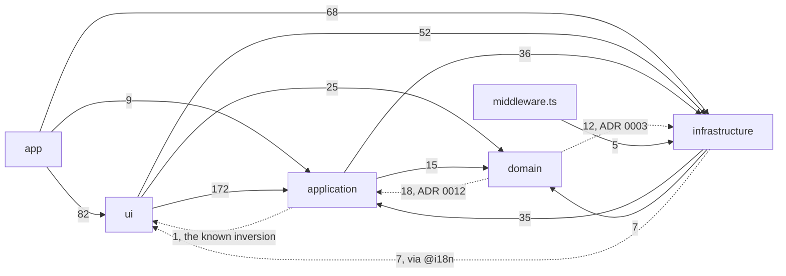

Forever PTO is a Next.js App Router application organized into layers under `apps/web/src/`, plus `apps/web/src/middleware.ts` at the root of the tree. Each layer has a single responsibility and a deliberate dependency direction.

## The layers

| Layer | Path | Responsibility |
| --- | --- | --- |
| App | `apps/web/src/app/` | Next.js App Router: routes, layouts, API handlers, metadata, sitemap/robots. Composition only; see [routing](/architecture/routing/). |
| Application | `apps/web/src/application/` | Data contracts (DTOs), Zustand stores, Effect use-cases, `next-intl` navigation glue (`apps/web/src/application/i18n/navigation.ts`), email templates and export generators. |
| Domain | `apps/web/src/domain/` | Pure business logic: the calendar suggestion engine (`apps/web/src/domain/calendar/`) and payment domain events/handlers (`apps/web/src/domain/payment/`). |
| Infrastructure | `apps/web/src/infrastructure/` | Everything that talks to the outside world: SDK clients, services, the proxy helpers, the calculation Web Worker (`apps/web/src/infrastructure/workers/`), i18n runtime config and `.well-known` payloads. |
| UI | `apps/web/src/ui/` | React modules (`apps/web/src/ui/modules/`), hooks, styles (`apps/web/src/ui/styles/`), assets and i18n message catalogs (`apps/web/src/ui/i18n/messages/`). |

## Dependency direction

This section used to draw `app → ui → application → domain` with a couple of side arrows, and that picture was read
off the intent rather than off the tree. Walking every `import`, `import type`, dynamic `import()` and
`vi.mock` specifier under `apps/web/src` gives **more** production edges between the layers plus
`middleware.ts` than the old figure drew. The largest one it left out was `app → infrastructure`,
one of the heaviest edges in the package. It also mixed separate relations under one
arrow head, labelling infrastructure as *reached through use-cases, services and adapters*: that is a call
path, not an import, and a diagram whose arrows mean `imports` cannot carry both.

The table below is the graph, counted from the tree with tests excluded, as `imports/files`. An empty cell is
an edge that does not exist. `tests/docs-consistency.test.ts` fails when this table and the tree disagree in
either direction, so it is a measurement rather than a drawing.

| from / to | `app` | `ui` | `application` | `domain` | `infrastructure` |
| --- | --- | --- | --- | --- | --- |
| `app` | | 82/16 | 9/6 | | 68/20 |
| `ui` | | | 172/80 | 25/19 | 52/41 |
| `application` | | 1/1 | | 15/8 | 36/11 |
| `domain` | | | 18/13 | | 12/3 |
| `infrastructure` | | 7/2 | 35/25 | 7/5 | |
| `middleware.ts` | | | | | 5/1 |

The same graph drawn, every arrow an `imports` edge that exists in the tree and its weight the count above. The
two upward arrows out of `domain` and the one out of `infrastructure` are the deliberate inversions the bullets
below explain:

Read the shape rather than the numbers. These are worth naming, and most of them are arrows the old
figure said were not there:

- **`app` never imports `domain`.** It is the only empty cell a reader would expect to be full, and it is the
  layering claim this package actually keeps: a route handler or a page reaches a business rule through
  `@application/use-cases/*` or through the calculations worker, never directly.
- **`domain` imports upwards, in both directions.** `domain → application` is the calendar context reaching
  `HolidayDTO` and the shared date helpers; that arrow points the wrong way on purpose, and
  [ADR 0012](https://github.com/fbuireu/forever-pto/blob/main/adr/0012-shared-date-helpers-stay-in-the-application-layer.md)
  records what every alternative costs. `domain → infrastructure` is the payment context composing Effect
  programs against service tags, which is
  [ADR 0003](https://github.com/fbuireu/forever-pto/blob/main/adr/0003-pure-calendar-domain-effectful-payment-domain.md).
- **`infrastructure` imports upwards too**, and one of those edges was undocumented until this page was
  corrected: imports in a couple of files reach `apps/web/src/ui/i18n/messages/*.json` through the `@i18n`
  shorthand. The infrastructure guide said nothing there imports from `@ui/*`, which was true of the literal
  specifier and false of the layer.
- **`application → ui` is a single import**, `stores/premium.ts` reaching `checkSession`, the known inversion
  `apps/web/src/application/AGENTS.md` records. One is the number; the contract suite fails a second.

The normative statements live in [`CODING_STANDARDS.md`](https://github.com/fbuireu/forever-pto/blob/main/CODING_STANDARDS.md), and this page links rather than restates them:

- Its *Tooling already enforces* section lists the import rules the contract suite holds the code to: what each
  domain context may import from outside itself, what the application layer may not reach, and what the UI takes
  from where. `apps/web/src/domain/AGENTS.md` says why the test for a new calendar entry is the runtime rather
  than the layer.
- `I1` to `I16` say how the outward-facing layer is built.
- `U1` and `U2` list the pure value helpers the UI may take from `@domain/calendar` and the infrastructure seams
  it may import, and why it must not reach the planning engine itself.

Facts about the system that no import arrow carries, and that the old figure tried to put on one:

- Stores in `apps/web/src/application/stores/` never call SDK clients directly; they delegate to
  `apps/web/src/infrastructure/services/*`.
- Server-side composition of external dependencies happens once, in `apps/web/src/infrastructure/layers.ts`
  (`ApplicationLayer`). That is runtime wiring, not an import direction; see
  [Effect layers](/architecture/effect-layers/).

Which practices this tree takes from domain-driven design, which it takes in part and which it rejects, is
[ADR 0014](https://github.com/fbuireu/forever-pto/blob/main/adr/0014-ddd-where-it-pays.md).

## An AGENTS.md per folder

Per the repo's root `AGENTS.md`, every significant folder carries its own `AGENTS.md`: the folder's map, the couplings a change there has to carry, its runtime gotchas and its guardrails; read it before touching the folder. Examples: `apps/web/src/domain/AGENTS.md` (the two contexts and their imports), `apps/web/src/infrastructure/clients/AGENTS.md` (the Effect client pattern), `apps/web/src/application/stores/AGENTS.md` (the stores and what each persists). The rules a review holds each layer to are in [`CODING_STANDARDS.md`](https://github.com/fbuireu/forever-pto/blob/main/CODING_STANDARDS.md); this page summarizes them. `CONTEXT.md` is a different document and exists **only** at the repo root, where it is the domain glossary. A nested one is forbidden, because the name would be ambiguous.

## Path aliases

Declared in `apps/web/tsconfig.json` (`compilerOptions.paths`), not at the repo root: the root
`tsconfig.json` covers `tests/` and excludes `apps/` outright. `apps/web/vitest.config.ts` sets
`resolve.tsconfigPaths`, so a new alias is one edit; the docs site replicates the single one it needs,
`@ui/*`, in `apps/docs/tsconfig.json`.

| Alias | Target |
| --- | --- |
| `@app/*` | `./src/app/*` |
| `@infrastructure/*` | `./src/infrastructure/*` |
| `@domain/*` | `./src/domain/*` |
| `@ui/*` | `./src/ui/*` |
| `@application/*` | `./src/application/*` |
| `@assets/*` | `./src/ui/assets/*` |
| `@styles/*` | `./src/ui/styles/*` |
| `@i18n/*` | `./src/ui/i18n/*` |

That is the whole list. This page carried extra rows, `@mocks/*` and `@types/*`, pointing at
`apps/web/src/mocks` and `apps/web/src/types`; neither alias is declared and neither directory exists. The
rule keeping the same table honest in `apps/web/AGENTS.md` read only that file, so the published copy could
drift and did. It reads both now.

`@assets`, `@styles` and `@i18n` all point inside `apps/web/src/ui/`: they are shorthands, not separate
layers, which is why an `@i18n/...` import from `apps/web/src/infrastructure/` is an `infrastructure → ui`
edge and appears as one in the table above. Each package has its own `tsconfig.json`, so they type-check
independently; the app's aliases carry no `baseUrl` and resolve against that file.

## Related pages

- [The layers in detail](/architecture/layers/) walks each node of the graph above: what it holds, where it runs, what it may import.
- [What runs where, and when](/architecture/when-and-where/) orders the same code by moment: build, deploy, edge, page load, interaction, worker.
- [Routing](/architecture/routing/) covers how `apps/web/src/app/` is laid out.
- [Proxy](/architecture/proxy/) covers the per-request chain.
- [Effect layers](/architecture/effect-layers/) covers server-side dependency injection.
- [Caching](/architecture/caching/) covers why Cache Components are off and the R2 incremental cache.
