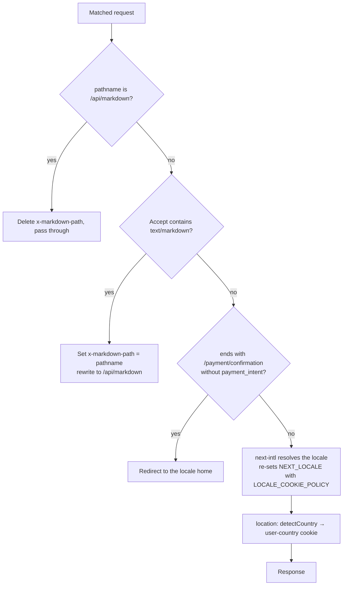

`apps/web/src/middleware.ts` is the single per-request entry point. Next calls this artefact the proxy and would have it at `proxy.ts`; the older file name is kept deliberately, because the name is what picks the runtime. `proxy.ts` always runs on Node.js, and OpenNext's Node middleware bundling is experimental: under it the header edits this chain makes never reach the route. `middleware.ts` keeps the chain on the edge runtime, where it works. [ADR 0009](https://github.com/fbuireu/forever-pto/blob/main/adr/0009-next-16-2-pinned-by-the-cloudflare-adapter.md) carries the evidence. The old `/architecture/middleware/` address redirects here, and this page keeps the proxy address because the concept is Next's, not the file's. It runs a short, strictly ordered chain and returns as early as it can. Each step delegates to a focused helper; the proxy file itself is orchestration only.

## The matcher

```ts
export const config = {
  matcher: ['/((?!api|_next|_vercel|.*\\..*).*)', '/api/markdown'],
};
```

Everything under `/api`, Next internals (`/_next`, `/_vercel`) and any path with a file extension are skipped, with one deliberate exception: `/api/markdown` is matched so a direct hit on it can be told apart from a rewritten one (step 1).

**The markdown rewrite trusts this matcher to keep internal paths out.** `/.well-known/*` contains a dot and `/api/*` is excluded outright, so neither ever reaches the proxy and the rewrite branch carries no guard of its own. Widening the matcher means adding one back.

## The chain, in order



Only the last branch reaches country detection; the three early returns skip it, which is why a Markdown rendition or a bounced confirmation URL never carries a fresh `user-country` cookie.

1. **Direct hits on `/api/markdown` strip the path header.** The request passes through with `x-markdown-path` **deleted** and nothing else changed. Without this branch a direct request carrying `Accept: text/markdown` would match the next rule and rewrite the route onto itself; deleting the header is what stops a caller driving the route by hand.

2. **Markdown content negotiation.** A request carrying `Accept: text/markdown` is rewritten to `/api/markdown`, with the pathname set on the `x-markdown-path` **request header** (`MARKDOWN_PATH_HEADER`, exported from `apps/web/src/infrastructure/markdown/twin.ts`). A rewrite does not change what the handler reads from the URL, so a query string never reached it. The proxy states **no** cache policy at all: it runs before the lookup, and the module that knows whether the page was found owns the headers; see the [Markdown API](/how-it-works/markdown-api/) page.

3. **Payment-confirmation guard.** Any path ending in `/payment/confirmation` without a `payment_intent` search param is redirected to the locale home. The confirmation page can therefore assume the param exists.

4. **i18n.** `createMiddleware(routing)` from `next-intl/middleware` resolves the locale (routing config in `apps/web/src/infrastructure/i18n/routing.ts`). If next-intl set the locale cookie (`LOCALE_COOKIE`, exported from `apps/web/src/infrastructure/i18n/locales.ts`), the proxy re-sets it via `setLocaleCookie` from `apps/web/src/infrastructure/i18n/cookie.ts`, which applies `LOCALE_COOKIE_POLICY`. That is the **same object** `routing.ts` hands next-intl, which is the point: the client-side language switcher writes this cookie too, so the two writers have to agree on its attributes. Cookie details are catalogued in the [cookies reference](/reference/cookies/).

5. **Country detection: always last.** The i18n response is passed through `location()` from `apps/web/src/infrastructure/proxy/location.ts`, which runs `detectCountry(request)` and, when a country is found, sets the `USER_COUNTRY_COOKIE` cookie via `apps/web/src/infrastructure/proxy/cookie.ts`. This cookie is intentionally readable from client JS: the location store uses it to preselect the user's country. The detection strategy chain (Cloudflare trace → `cf-ipcountry` header → IP lookup) is documented in [country detection](/how-it-works/country-detection/).

Running country detection last matters, but note it only ever decorates the **i18n response**: the markdown branches and the payment-confirmation guard `return` early and skip it entirely, so those responses never carry a fresh `user-country` cookie.

## Why proxy helpers live in infrastructure

The proxy imports nothing framework-agnostic itself; the actual logic (`detectCountry`, cookie writers) lives under `apps/web/src/infrastructure/proxy/` and `apps/web/src/infrastructure/services/location/`, keeping `apps/web/src/middleware.ts` a readable table of contents for the request pipeline and keeping the helpers unit-testable (`apps/web/src/middleware.test.ts` covers the orchestration).
