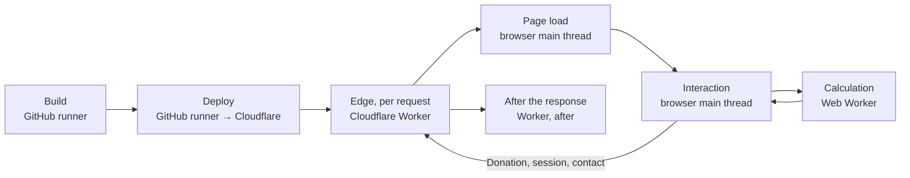

The [layers](/architecture/layers/) page is organised by folder. This one is organised by **moment**: the same code, asked "when does this run, and on which machine?". Most confusion about the app comes from a value being read at a different time than it is written, so every row names both.

## At build time, on the runner

`cf:build` runs `next build` through OpenNext. Everything below is decided **once per deploy** and cannot change until the next one:

| What | How | Consequence |
| --- | --- | --- |
| Every page, in every locale | `generateStaticParams` over `LOCALES`; Cache Components are off ([ADR 0015](https://github.com/fbuireu/forever-pto/blob/main/adr/0015-cache-components-stay-off-on-the-workers-runtime.md)) | The planner's HTML is prerendered; the only per-request pages are `/_not-found`, `sitemap.xml` and the payment confirmation |
| The public variables | `NEXT_PUBLIC_*` from the GitHub environment, validated against the zod schemas in `PUBLIC_ENV` (`next.config.ts`) and inlined into the client bundle | The Stripe publishable key, the analytics ids and the storage obfuscation key ship in the bundle; rotating one needs a deploy |
| The current year the marketing page shows | `getCurrentYear`, an async server helper evaluated during prerender | The homepage's year is the build's, not the visitor's; the planner reads the year from the filters store instead |
| Fonts | `next/font/google` downloads and self-hosts the four families and emits the `--font-*` variables | The CSP names no font host; the wiki self-hosts the same faces separately |
| Skeletons | `boneyard-js` generates the bones from fixture renders into `apps/web/src/ui/modules/bones/` | A layout change regenerates its skeleton with `pnpm bones:build` rather than drifting from it |
| The Markdown twins | `buildMarkdownPage` imports every locale's bundle statically and translates with `createTranslator` | A missing locale row is a compile error, not a runtime blank |
| The Web Worker chunk | The bundler detects `new Worker(new URL(..., import.meta.url))` in `useCalculationsWorker` | The engine ships as its own chunk, loaded on the first calculation |

## At deploy time

`wrangler deploy --env <stage>` uploads the Worker, and the runtime secrets ride the same call on `--secrets-file`, so a version and the values it reads are one atomic thing. Bindings (`NEXT_INC_CACHE_R2_BUCKET`, `PAYMENT_RATE_LIMITER`, `ASSETS`), `[vars]` and `[observability]` come from `wrangler.toml`. Nothing in the app reads a secret until a request needs it: each client resolves its own configuration lazily inside the call and reports a missing variable as its own tagged error, so a missing `RESEND_API_KEY` breaks the contact form and nothing else. The [secrets](/infra/secrets/) page has every class of value and its home.

## At the edge, on every request

In this order, on a Cloudflare Worker, before any page code runs:

1. **The proxy** (`apps/web/src/middleware.ts`), for every path its matcher admits: Markdown negotiation for agents, the payment-confirmation guard, locale resolution, the `NEXT_LOCALE` cookie re-set with the shared policy, and **Country detection last**, writing the `user-country` cookie. The whole chain is a few milliseconds; the Country step is the one that can wait on a network call, capped at five seconds per strategy. See [proxy](/architecture/proxy/) and [country detection](/how-it-works/country-detection/).
2. **The security headers**, from `next.config.ts`, on every response including the ones the proxy never sees.
3. **The page**, served from the prerendered output, or **the route handler**, which runs an Effect program against `ApplicationLayer` inside a named span and maps its typed failure onto a status. The three routes that cost money or grant Premium check the rate limiter before reading the body ([rate limiting](/how-it-works/rate-limiting/)).
4. **The invocation log and spans**, collected by the runtime and exported to the stage's destinations without the app doing anything ([observability](/how-it-works/observability/)).

The planner's plan is never part of this. The edge sees a Country and a locale; it never sees a Holiday, a budget or a Suggestion.

## After the response, still on the Worker

Work that must not delay the reply is returned by the use case as a `deferred` Effect and scheduled with `after()` from `next/server`, which runs once the response has been sent: the payment row insert after `POST /api/payment`, the upsert after activation, the contact row after the email. Each is re-provided with `ApplicationLayer` and swallows its own failure into a warning log, and for payments the Stripe webhook is the second writer that converges the table if the deferred write died. See [Effect layers](/architecture/effect-layers/).

## On page load, in the browser

In this order, once the HTML arrives:

1. **Providers mount** from `apps/web/src/app/[locale]/layout.tsx`: the theme provider, `LazyMotionProvider` (which loads `domAnimation` on demand), the intl client provider, the bones provider, the consent client, WebMCP and the two analytics mounts, both inert until consent.
2. **The five stores rehydrate** from `localStorage`, each reviving its dates from ISO strings and wiping its own key on a corrupt blob. `useStoresReady` gates every planner section on `hasHydrated`, and each section renders its generated skeleton until then, so nothing paints twice.
3. **`StoresInitializer`** reads the `user-country` cookie and seeds the Country, only when the user has never chosen one.
4. **`PremiumSessionSync`** asks `GET /api/check-session` whether the `premium-token` cookie still verifies, and the premium store mirrors the answer; the store also flips `needsSessionCheck` on its own when its last verification is older than 24 hours.
5. **Consent** decides whether the Google tag and the Better Stack tag load at all. Before a decision, the Consent Mode defaults are `denied` and neither script exists in the page.
6. **The planning loop starts**: `CalendarList` refetches Holidays for the stored Country and window and, once the budget and the Holidays are in, triggers the first calculation ([the planner screen](/how-it-works/planner-ui/)).

## On every interaction

A sidebar field writes one value to the filters store, and `CalendarList`'s effects do the rest: a Country, Region, year or Carry-over change refetches Holidays; any planning input change, or a `planRevision` bump from a Holiday edit, triggers a calculation. A calendar click never re-plans the year: `toggleDaySelection` writes a Manual or Removed Day, recomputes the budget readout locally, and the hand-edited days reach the engine only as inputs to the **next** run, read non-reactively by the worker hook. Applying an Alternative writes it as `currentSelection` and clears the Removed Days. Every refusal (weekend, Holiday, exhausted budget, plan in flight, no Premium) is a `DayRefusal` the calendar turns into a toast rather than a silent no-op.

The exports run here too: the PDF path dynamic-imports `@react-pdf/renderer` inside a transition on the first click, the ICS path is a string builder, and both hand the browser a blob to download ([exports](/how-it-works/exports/)).

## Inside the Web Worker

Every calculation is a fresh worker: the hook terminates the in-flight one, spawns a new one, and posts one `CALCULATE_SUGGESTIONS` message with every `Date` as an ISO string. The worker deserialises, narrows the Strategy and locale, runs `runPlanningPipeline` synchronously (tens of milliseconds for a year) and posts back a measured Suggestion and its Alternatives, or a `WORKER_ERROR`. A reply whose `requestId` is stale is dropped. The worker has no DOM, no store and no network; the [calculation worker](/how-it-works/calculation-worker/) page has the protocol and the [planning algorithm](/how-it-works/planning-algorithm/) what runs inside.

## When the user leaves

Nothing is sent anywhere. The plan, the Custom Holidays, the Manual Days and the budget stay in `localStorage`, [obfuscated](/how-it-works/data-protection/) with the build-time key, and are what the next visit rehydrates. The year is the one field deliberately not persisted, so a visit in January plans the new year rather than the one the user left. Losing local storage loses the plan, which is the cost [ADR 0001](https://github.com/fbuireu/forever-pto/blob/main/adr/0001-planner-runs-in-the-browser.md) accepted and the [exports](/how-it-works/exports/) exist to mitigate.
