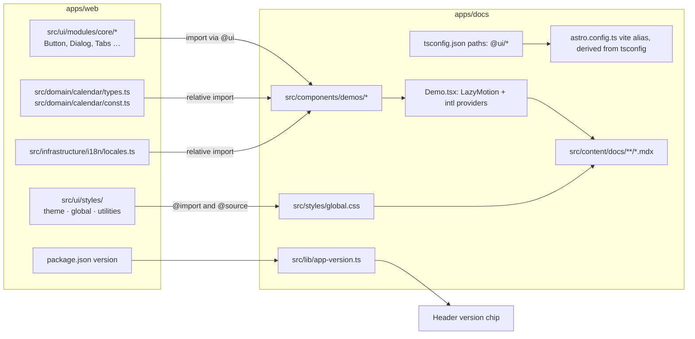

This site is the `apps/docs` package: an [Astro Starlight](https://starlight.astro.build) build served as static assets from a Cloudflare Worker. What makes it more than a wiki is that the design-system pages render the app's **own** components, imported straight from `apps/web/src/ui`, styled by the app's own stylesheets, and typed against the app's own props. A rename in the app breaks this site's typecheck before it can drift. This page is how that works.



## Two packages, one install

`apps/web` and `apps/docs` are sibling workspace packages. The docs site never lists the app as a dependency; it compiles the app's **source files** directly. That is why the install has to be unfiltered: a demo imports `Button.tsx`, which imports `class-variance-authority` bare, and a bare import resolves from the `node_modules` of the package the *importing file* sits in, which is `apps/web`. A `--filter forever-pto-docs` install leaves that folder empty and the build fails on a dependency the docs package never declared. The `prepare-env` composite action in CI installs the whole workspace for this reason.

## The `@ui` alias

The seam is declared **once**, in `apps/docs/tsconfig.json`:

```json
{ "compilerOptions": { "paths": { "@ui/*": ["../web/src/ui/*"] } } }
```

`astro.config.ts` reads that file at startup and derives the Vite alias from the same string, so `astro check` (which reads `tsconfig.json`) and `astro build` (which reads the Vite config) cannot point at different folders. Move the app's UI layer and there is one line to change; the config throws at startup if the path is missing rather than letting every demo fail to resolve one by one.

A demo then imports exactly what the app imports:

```tsx
import { Button } from "@ui/modules/core/primitives/Button";
```

Not every reach goes through the alias. `HowItWorksDemo.tsx` imports `FilterStrategy` from `apps/web/src/domain/calendar/types.ts` and `LOCALES` from `apps/web/src/infrastructure/i18n/locales.ts` by relative path, and `PlanningEngineDemo.tsx` imports `PTO_CONSTANTS` from `apps/web/src/domain/calendar/const.ts` the same way. All three are dependency-free modules; that is the condition, and the contract suite (below) asserts that every path the site reaches into is also a path the docs workflow rebuilds on.

## What can be rendered, and why

A module can be demoed when nothing in its import graph touches Next.js or an app layer: no `next/*`, no `next-themes`, no `@application`, `@domain` or `@infrastructure` beyond the three files above. That rules out `RichLink` (next-intl's `Link`), `Sonner` (`next-themes`), `Combobox` (app DTO types), `Sidebar` (cookie persistence and the mobile hook), `Form` (react-hook-form) and `FlagIcon` (a stylesheet the app loads); they are documented on the [reference components](/design-system/patterns/reference-components/) page from their source.

Everything else renders as a React island with `client:visible`, and a component that needs an app context gets it from `Demo` rather than remembering to ask: `Demo.tsx` wraps every demo in `LazyMotionProvider`, which every `m.*` consumer needs, and in `DemoIntlProvider`, which the two `next-intl` readers in `core/` need (`SlidingNumber` picks its decimal separator from the locale; `Counter` wraps it). Both would throw during prerender otherwise, since `client:visible` still renders on the server. The frame carries `data-demo`, and a chip naming the source sits *outside* it, because the demo suite counts the frame's children and a chip inside would let an empty demo pass as rendered.

## The drift guards

Prose names a file, never a volatile literal. Where the app exports a constant the page imports it and interpolates; where a component has variants or props, a demo builds a `Record` that is exhaustive over the real type:

| Guard | Type it is exhaustive over | What breaks it |
| --- | --- | --- |
| `VariantsTable` rows | `VariantProps<typeof buttonVariants>` | A variant added, renamed or removed in the app |
| `PropsTable` rows | `OwnProps<ComponentProps<typeof X>, Base>`: the component's keys minus the element or primitive it wraps | A prop the app adds, renames or removes |
| `StrategiesTable` | `Record<FilterStrategy, string>` | A Strategy added or renamed in `types.ts` |
| `TunablesTable` | Every leaf of `PTO_CONSTANTS`, by a recursive key type | A tunable added, renamed or removed in `const.ts` |
| `TokenSwatch`, `ShadowScale`, `TypeSpecimen` | None; they read CSS variables at render time | A renamed token renders transparent, which the contract suite catches instead |

Each fails `astro check`, which runs in `pnpm typecheck` at the repository root and in the docs workflow, so an app pull request that breaks a page here fails its own CI rather than the docs' later.

## The app's stylesheets, reused

`src/styles/global.css` imports the app's `theme/index.css`, `global/index.css` and `utilities/index.css` directly, so the tokens the demos read (`--frame`, `--accent`, the `--shadow-brutal-*` scale) are the app's values, in light and dark. It never imports the app's `index.css`: that carries a full Tailwind preflight and a layer order that collides with Starlight's. The import order in that file is deliberate and its header comment says why; read it before touching it.

Two more directives close the loop. `@source` points Tailwind at `apps/web/src/ui/modules/core` and at the homepage's `shared.ts`, so the utilities those files name are generated here even though no file in this package writes them. And the four font families the app registers through `next/font` are self-hosted here through `@fontsource` and pointed at the same `--font-*` variable names, since there is no Next here to inject them; the contract suite asserts every registered variable is declared.

## Diagrams

Every diagram on this site is a ```mermaid fence in the page's source. Starlight runs on Sätteri, Astro's default Markdown processor, which takes mdast plugins rather than remark ones, so `src/lib/mermaid-plugin.ts` turns each fence into a `<pre class="mermaid" data-mermaid="…">` before Expressive Code can highlight it as text. In the browser, `src/lib/mermaid.ts` lazy-loads Mermaid only on a page that carries a fence, draws every diagram with the app's tokens read off `:root` at render time, redraws when the theme toggle rewrites `data-theme`, and lets a click toggle a wide diagram between the column width and its natural size. The source travels URI-encoded in the attribute and as the element's text, so a reader without JavaScript sees the definition.

## What keeps it honest

Three suites, each catching what the others cannot:

- **`astro check`** typechecks the demos against the app's real props. It does not see MDX, CSS or a `@ui/…` specifier that points at nothing.
- **The contract suite**, `tests/docs-consistency.test.ts` at the repository root, reads this package as text. It resolves every `@ui` specifier, every relative `@import` and `@source`, every `.ts`/`.tsx` file a page names in backticks and every constant a page names in prose against the tree; asserts the prose uses the glossary's canonical terms rather than retired ones; checks every design token a page names is still declared; and derives the whole reach into `apps/web` from the sources and asserts `docs.yml` triggers on each path. It runs with `pnpm test:docs` and in the app's own CI.
- **Playwright**, in `apps/docs/e2e/`: `demos.spec.ts` walks every page the build emitted a `data-demo` frame onto and asserts it answers 200, renders something in each frame once scrolled into view, and raises no page error or console error, which is the only thing that sees a demo that builds green and throws on hydration; `tailwind-sources.spec.ts` proves the `@source` directives still generate a class this package never writes; `docs.spec.ts` covers the theme toggle and the token seam; `smoke.spec.ts` runs against the deployed site after every production deploy.

The build, preview and deploy pipeline is the [docs CI](/infra/docs-ci/) page; the conventions for a docs pull request are on the [conventions](/contributing/conventions/) page.
