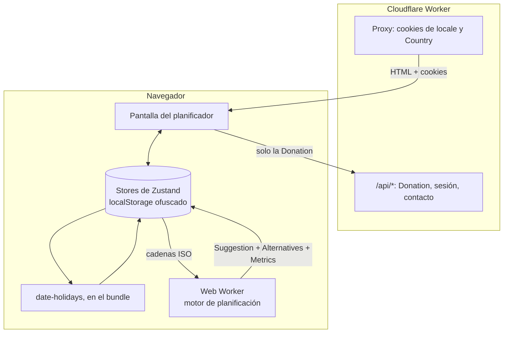

import { Card, CardGrid } from '@astrojs/starlight/components';

## Todo el producto en una imagen

Lo importante ocurre en el navegador: el edge solo detecta un Country y sirve HTML prerenderizado, y el plan nunca sale del dispositivo.

<CardGrid stagger>
  <Card title='Empieza aquí' icon='rocket'>
    Qué hace el producto, qué entradas toma y qué plan devuelve; después, cómo ejecutarlo en local y cómo está
    organizado el repositorio. [Qué hace el planificador →](/es/start/what-the-planner-does/)
  </Card>
  <Card title='Cómo funciona' icon='information'>
    Una petición seguida desde el edge hasta la última Metric, y luego cada subsistema: el algoritmo con sus
    parámetros leídos del código, las fuentes de Holidays, el Web Worker, la pantalla del planificador, los stores.
    [Visión general →](/es/how-it-works/overview/) · [El algoritmo →](/es/how-it-works/planning-algorithm/)
  </Card>
  <Card title='Arquitectura' icon='open-book'>
    El árbol por capas bajo `apps/web/src/`, con el grafo de dependencias medido sobre los imports y no dibujado
    desde la intención, la cadena del proxy por petición y la capa de servicios con Effect.
    [Visión general →](/es/architecture/overview/)
  </Card>
  <Card title='Design system' icon='puzzle'>
    La librería de componentes neobrutalista, renderizada en vivo desde las fuentes de la app, con props, notas de
    accesibilidad y dónde se usa cada componente. [Componentes →](/es/design-system/components/overview/)
  </Card>
  <Card title='Infraestructura y CI/CD' icon='setting'>
    Cloudflare Workers a través de OpenNext, un Worker por pull request, el pipeline de release con smoke tests y
    las tags que mantienen dos paquetes versionados por separado. [Entornos →](/es/infra/environments/)
  </Card>
  <Card title='Referencia y contribuir' icon='pencil'>
    El glosario en el que está escrito el código, cada cookie que la app establece, y las convenciones, tooling y
    reglas de testing que un cambio tiene que cumplir. [Glosario →](/es/reference/glossary/) ·
    [Convenciones →](/es/contributing/conventions/)
  </Card>
</CardGrid>
