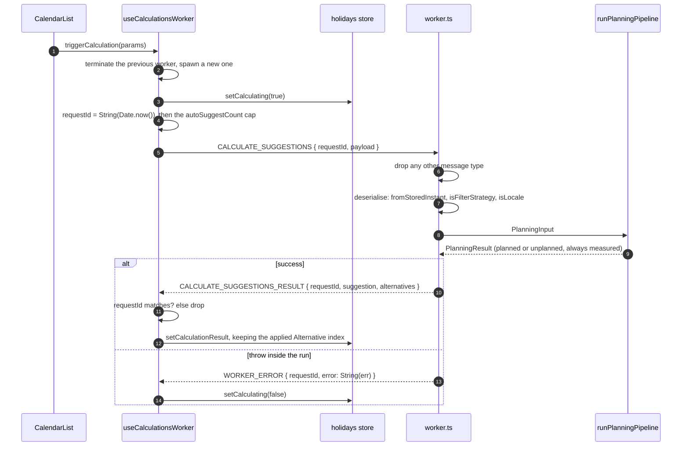
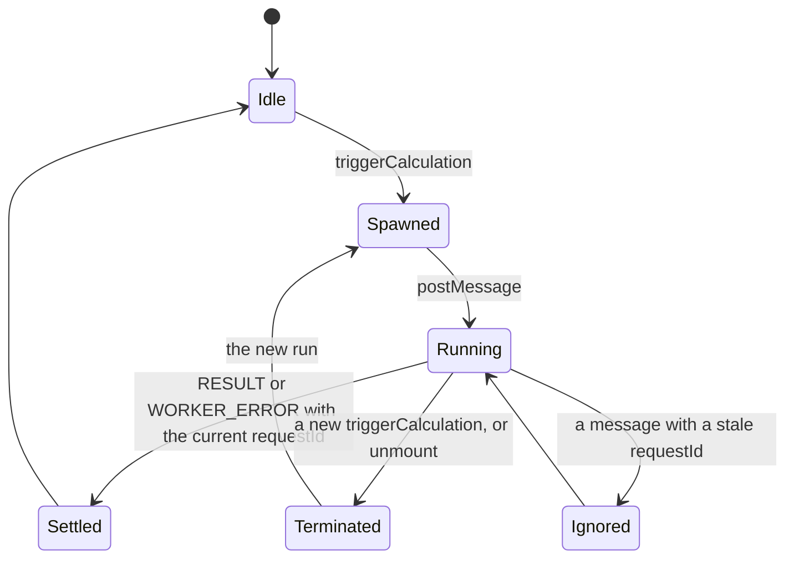

Generating a Suggestion, its Alternatives and the Metrics for each is the one piece of work in the app long enough to stutter a slider drag if it ran on the main thread. So the planner runs the whole [planning pipeline](/how-it-works/planning-algorithm/) inside a **Web Worker**: `apps/web/src/infrastructure/workers/worker.ts`, spawned and driven by the `useCalculationsWorker` hook in `apps/web/src/ui/hooks/useCalculationsWorker.ts`.

This is a Web Worker in the browser, not a Cloudflare Worker. Nothing in that folder runs on the server.

## The protocol

One request, one reply, correlated by a `requestId`:

The message types are the `WORKER_MESSAGE_TYPE` constant in `apps/web/src/infrastructure/workers/types.ts`, and the same file carries the wire types: `CalculateSuggestionsRequest`, `WorkerResponse` (a discriminated union of the result and the error) and the `Serialized*` shapes. A message whose type is not `CALCULATE_SUGGESTIONS` is dropped without a reply: the worker is not a dispatcher, and a second message type would be a second early return rather than an `else`.

The handler is wrapped end to end in `try`/`catch`, so the main thread gets exactly one message per request. The hook still installs `onerror` and `onmessageerror`, because a worker that fails to **load** never reaches that code.

## The lifecycle

**A worker per calculation, on purpose.** Every trigger terminates the in-flight worker and spawns a fresh one with `new Worker(new URL('../../infrastructure/workers/worker', import.meta.url))`, the shape the bundler detects statically to emit a worker chunk. That reads like waste and is not: the handler is fully synchronous, so a reused worker could not be preempted; queued messages would sit behind the running computation and execute to completion. `terminate()` is the only thing that actually cancels a run. The `requestId` guard discards stale **results**; it does nothing about stale **work**, and dragging the PTO slider produces a dozen stale runs a second.

On unmount the hook terminates whatever is running and, if a request was still pending, clears the store's `isCalculating` flag so the UI cannot be left in a loading state with nobody to end it.

## The boundary: every `Date` as an ISO string

`postMessage` could carry a `Date` through structured clone. The protocol deliberately does not: `SerializedHolidayDTO`, `SerializedBridge` and `SerializedSuggestion` spell every date as a string, so the boundary is an explicit, inspectable type both sides agree on, and `apps/web/src/infrastructure/workers/utils/serializers.ts` is the only module that converts in either direction. Adding a `Date` field to a domain type that crosses here means adding it to the serialiser and to the wire type, or it arrives as a string typed as a `Date`.

The way back from a string is `fromStoredInstant` (`apps/web/src/application/shared/utils/dateIntake.ts`), not `new Date`: everything crossing here was written by this app with `toISOString()`, so the instant is what round-trips, the same provenance the persistence layer has.

`Metrics` is the one domain type reused verbatim on the wire, and that is safe only while it carries no `Date`. `MetricsHoldNoDate` in `types.ts` is that claim as a type: an added `measuredAt?: Date` fails one line, in the file that makes the reuse, naming the field.

## What travels in the request

| Field | From | Notes |
| --- | --- | --- |
| `year`, `carryOverMonths` | Filters | The engine expands the Planning Window itself |
| `ptoDays` | Filters | The whole budget; the engine subtracts Manual Days |
| `holidays` | The holidays store, through `serializeHolidays` | National, Regional and Custom |
| `allowPastDays`, `strategy`, `locale` | Filters | `strategy` and `locale` are **narrowed** on arrival, with `isFilterStrategy` and `isLocale`, falling back to `DEFAULT_FILTER_STRATEGY` and English, because this is the inbound leg where a value out of persisted storage arrives |
| `maxAlternatives` | The holidays store | Four |
| `manualDays`, `removedDays` | The holidays store, as ISO strings | Manual Days become pseudo-Holidays **inside the pipeline**; Removed Days are struck from the Workdays and never become Free Days |
| `autoSuggestCount` | Computed by the hook | See below |

### The auto-suggest cap

When the budget has **not** changed since the last run and the user has taken Suggested Days back, the hook caps automatic suggestions at the number of Suggested Days still active, so an edit does not hand the user replacements for the days they just removed. When the budget changed, the whole new budget is used. A computed cap of zero is treated as "no cap": the stored empty plan is what the next run reads back, and without that guard an emptied selection would pin the cap at zero for good.

## What comes back

`PlanningResult`, serialised: a measured Suggestion and its measured Alternatives. The unplanned branch (no budget, or no candidate Bridge) still carries a real `Metrics` object **measured by the engine**, sized to the Planning Window. The worker used to hand-write that object as a constant, and it was wrong in a way nothing caught: a calendar year of monthly and quarterly buckets where the engine sizes both to the window, so with any Carry-over Month the empty plan reported a differently shaped `Metrics` than a real one.

`setCalculationResult` in the store writes the Suggestion and Alternatives and preserves the applied Alternative index across recalculations, so a user who applied option three keeps option three when they nudge the budget.

## What the worker does not do

It holds **no planning rule**. Clearing the caches, building the pseudo-Holidays, deriving the window, computing the budget, short-circuiting on an empty budget and measuring each plan all live in `runPlanningPipeline`; the worker deserialises, calls and serialises. The holidays store's own `generateSuggestions` action calls the same pipeline on the main thread, which exists for callers without a worker and is why the two paths cannot drift: there is one orchestration, not two copies kept in step by mirrored tests.

`Temporal` reaches this thread through `temporal-polyfill`, imported explicitly by the engine rather than read off the global, because this worker is one of the realms that has to work ([ADR 0005](https://github.com/fbuireu/forever-pto/blob/main/adr/0005-temporal-polyfill.md)).

## Testing

`apps/web/src/infrastructure/workers/worker.test.ts` stubs `self`, mocks `runPlanningPipeline` and drives `globalThis.onmessage` directly. It pins the boundary and only the boundary: the message-type guard, deserialisation into the pipeline's input names, the two narrowings, serialisation of the reply, that an unplanned result reaches the wire with the pipeline's own `Metrics`, and that a throw becomes `WORKER_ERROR`. The pipeline's behaviour is pinned once, against the real engine, in `apps/web/src/domain/calendar/pipeline.test.ts`. `apps/web/src/infrastructure/workers/CLAUDE.md` is the folder's own guide and carries the invariants in full.
