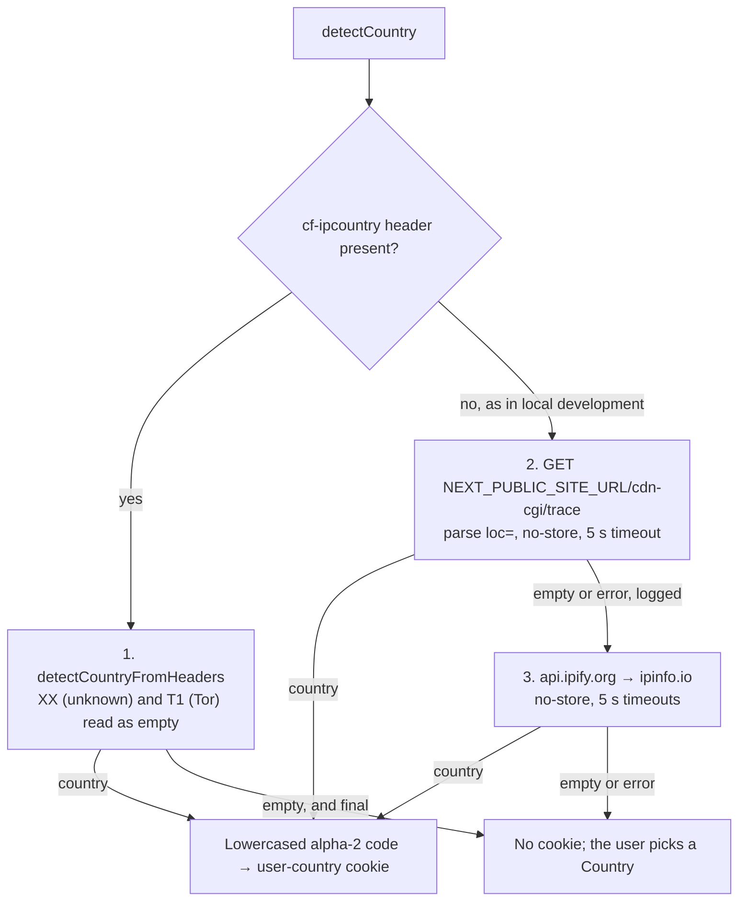

When you open Forever PTO, the planner already knows your country. That value travels in the `user-country` cookie (constant `USER_COUNTRY_COOKIE` in `apps/web/src/infrastructure/proxy/cookie.ts`), set by the proxy on every matched request.

## The chain

1. `apps/web/src/middleware.ts` runs the last step of the proxy, (after markdown negotiation, the payment-confirmation guard and i18n) calls the location proxy with the `next-intl` response.
2. `apps/web/src/infrastructure/proxy/location.ts`: `location()` re-sets a `user-country` cookie the request already carries, which renews its week, and detects nothing. Only without one does it run `detectCountry(request)`, and it calls `setLocationCookie()` only if a country came back.
3. `apps/web/src/infrastructure/services/location/detectCountry.ts` takes the `cf-ipcountry` header's answer whenever the header is present, and tries the two network strategies in order only when it is absent.
4. `apps/web/src/infrastructure/services/location/utils/strategies.ts` implements the strategies as Effect programs.

The proxy matcher skips `/api/*` (except `/api/markdown`), `/_next`, `/_vercel` and any path with a file extension, so the cookie is refreshed on page navigations, not on asset or API requests.

## The cookie

`setLocationCookie()` in `apps/web/src/infrastructure/proxy/cookie.ts` writes a lowercased ISO 3166-1 alpha-2 code with:

- `httpOnly: false` is deliberately client-readable; the stores initializer reads it in the browser to preselect the country.
- `secure: true`, `sameSite: 'strict'`, `path: '/'`.
- `maxAge: ONE_WEEK` (a constant exported next to `USER_COUNTRY_COOKIE`).

See [cookies](/reference/cookies/) for the full cookie inventory.

## The strategies, in order

Every strategy leaves through `normalizeCountryCode` (`apps/web/src/infrastructure/services/location/utils/normalize.ts`), the one exit rule: trim, lower-case, reject anything that is not two ASCII letters, and reject the sentinels `XX` (`UNIDENTIFIED_COUNTRY`) and `T1` (`TOR_COUNTRY`, Tor exit nodes). Both network strategies fetch through `noStoreFetch` beside it, which owns `cache: 'no-store'` and the 5-second `AbortSignal.timeout`.

### 1. `cf-ipcountry` header (`detectCountryFromHeaders`)

Reads the `cf-ipcountry` request header (`CLOUDFLARE_COUNTRY_HEADER`), which Cloudflare stamps on every request based on the **visitor's** IP. Synchronous, no I/O.

**When the header is present, its answer is final, even an empty one.** Cloudflare sends `XX` or `T1` when it cannot place the visitor, and the strategies below would then locate the Worker's own egress instead. Since no cookie is set on a failure, every navigation from such a visitor used to repeat up to three sequential subrequests for a wrong answer. In production the header is always there, so the two network strategies run only where it is not, which is local development.

### 2. Cloudflare trace (`detectCountryFromCDN`)

A server-side `fetch` of `${NEXT_PUBLIC_SITE_URL}/cdn-cgi/trace` (Cloudflare's trace endpoint). The response is plain text; the strategy parses the `loc=` line. Any failure is caught, logged as a warning, and resolves to `''` so the chain falls through, and the user never sees an error.

### 3. Egress IP lookup (`detectCountryFromEgressIP`)

Asks `api.ipify.org` for an IP, then `ipinfo.io/{ip}/json` for its country, and the whole program fails open to `''`.

## The crucial nuance

Strategies 2 and 3 run **inside the Cloudflare Worker**, so they geolocate the *Worker's egress*, not the browser. That is usually a colo near the user, but not guaranteed, especially with smart placement enabled (`[placement] mode = "smart"` in `wrangler.toml`), which may move the Worker closer to its backends and away from the visitor. That is why they come last and never overrule the header.

**Every fetch is `no-store`, and must stay that way.** Each response identifies whoever asked for it, so a stored copy would hand one visitor's Country to the next, and the proxy would write it into a week-long cookie.

The only strategy that genuinely reflects the end user is **strategy 1**, the `cf-ipcountry` header. Keep that in mind when debugging "wrong country detected" reports: in production the cookie holds what Cloudflare said about the visitor's IP, or nothing.

## Failure behavior

Nothing in this chain ever throws to the user. CDN and IP failures are swallowed (`Effect.catchAll` / `Effect.orElse`) and only the CDN path logs; see [observability](/how-it-works/observability/). If every strategy returns `''`, no cookie is set and the planner falls back to manual country selection backed by the [location store](/how-it-works/state-stores/).
