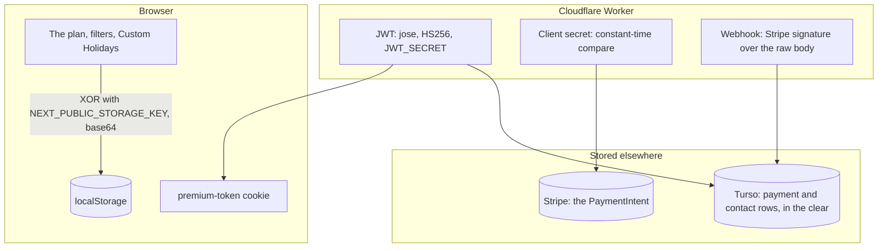

There is no password to hash here, and no plan to encrypt: the planner keeps everything on the device and the server only ever sees a Donation, a session check and a contact message. What follows is every place the app does apply a primitive, what each one actually protects, and the two places where the honest answer is "nothing, and here is why".

## Browser storage is obfuscated, not encrypted

Every persisted store writes through `obfuscatedStorage` (`apps/web/src/application/stores/crypto.ts`), which XORs the serialised JSON against `NEXT_PUBLIC_STORAGE_KEY` and base64-encodes the result (`obfuscate` / `deobfuscate` in `apps/web/src/application/stores/utils/crypto.ts`). The exported names say what it is, and so do these docs: **this is not encryption**. The key is a `NEXT_PUBLIC_*` variable, so it is inlined into the client bundle and anyone who opens the page has it. What it buys is that a plan is not readable at a glance in devtools and not editable with a text edit; what it does not buy is confidentiality against anyone who wants it. [ADR 0007](https://github.com/fbuireu/forever-pto/blob/main/adr/0007-persisted-client-state-is-obfuscated-not-encrypted.md) records why that is the right amount: the data never leaves the device, so the threat it defends against is shoulder-surfing and casual tampering, and real encryption would need a key the user supplies and a lost-plan story nobody wants.

Three branches, chosen once at module load:

| Condition | Storage |
| --- | --- |
| No `window` (server render) | A no-op: importing a store on the server neither reads nor writes |
| Development, or the key missing | Plain `localStorage`, so devtools show readable JSON while you work |
| Otherwise | Obfuscated |

A value that fails to decode logs and returns `null`, which Zustand treats as nothing stored, so a corrupt or key-rotated blob resets the store rather than breaking the planner. Never put anything confidential behind this, and never call it encryption in code, in a log line or on a page.

## The session token is signed

A Premium session is a JWT, minted and verified in `apps/web/src/infrastructure/services/premium/session.ts` with [jose](https://github.com/panva/jose): **HS256**, signed with `JWT_SECRET` (a runtime Worker secret, never public), carrying `{ email, paymentIntentId }`, issued at and expiring 30 days later. It is signed, not encrypted: the payload is readable by anyone holding the cookie, which is deliberate, because it holds nothing the holder does not already know about themselves.

It rides in the `premium-token` cookie (`apps/web/src/infrastructure/services/premium/cookie.ts`): `httpOnly`, `sameSite: 'strict'`, `secure` in production, `path: '/'`, 30-day `maxAge`. `httpOnly` is what keeps it out of reach of any script on the page, and `strict` is what keeps it off a cross-site request. `GET /api/check-session` verifies it and clears the cookie on any `SessionError` rather than leaving a token the server has stopped accepting.

## The client secret is compared in constant time

`GET /api/payment/activate` is Stripe's `return_url` and the one route that grants an entitlement, so it proves the caller was the payer: it retrieves the PaymentIntent and compares the `client_secret` the caller presented against the one Stripe holds. The comparison is `matchesClientSecret` (`apps/web/src/infrastructure/services/premium/activation.ts`), which refuses mismatched lengths and then ORs the XOR of every character pair, so it takes the same time whatever the input. A `===` there leaks, byte by byte, how much of a guess was right; that is the whole reason the helper exists rather than an inline comparison.

The route carries three more guards beside it: the [rate limiter](/how-it-works/rate-limiting/) runs first, `redirect_status` short-circuits before Stripe is called at all, and the redirect is explicitly `no-store` because it carries a `Set-Cookie`.

## The webhook verifies Stripe's signature

`POST /api/webhooks/stripe` reads the **raw** body with `request.text()` and hands it plus the `stripe-signature` header to `constructEvent` (`apps/web/src/infrastructure/clients/payments/stripe/serverService.ts`), which verifies the HMAC against `STRIPE_WEBHOOK_SECRET`. Parsing the body as JSON first would re-serialise it and break the signature, which is why this is the one route that does not go through `parseJsonBody`. A missing secret answers 400 `WEBHOOK_MISCONFIGURED` rather than 500: it can never succeed on redelivery, and a 400 marks the endpoint as failing in the Stripe dashboard instead of asking Stripe to keep trying. An invalid signature is 400 `INVALID_SIGNATURE`.

## What is stored in the clear, and where

| Where | Holds | Protected by |
| --- | --- | --- |
| Turso, `payments` | The PaymentIntent id, the donor's email, the amount, the status, the promo code, the user agent and the IP address | Transport (libSQL over HTTPS) and the auth token; the columns themselves are plaintext |
| Turso, `contacts` | The submitted name, email, message and Resend's `messageId` | The same |
| Stripe | The PaymentIntent and its metadata (email, promo code, user agent, IP) | Stripe's own storage |
| The browser | The plan, the filters, the Custom Holidays, the Premium key and email | Obfuscation, as above |

There is **no user table and no password**, so there is nothing to hash: Premium is derived from a succeeded payment row keyed by email ([ADR 0008](https://github.com/fbuireu/forever-pto/blob/main/adr/0008-premium-derived-from-payment.md)). Addresses are compared after `normalizeEmail` (trim and lowercase) on both sides, never hashed, because the recovery path has to look one up by exact value.

## What never reaches a log

Two rules, both enforced in code rather than by review:

- **Query strings are stripped.** `stripQuery` in `apps/web/src/infrastructure/logging/contract.ts` removes the query from any `url` field before the line is serialised, because Stripe appends `payment_intent_client_secret` to the return URL. Separately, `redact_query_string = true` in `wrangler.toml` does the same for the request URL the platform records, which is a different guarantee over a different value.
- **Email domains, not addresses.** Call sites log `emailDomain(email)` (`apps/web/src/application/shared/utils/redact.ts`) plus ids and flags. A full address in a log context is a defect.

The [observability](/how-it-works/observability/) page covers where those lines go and who can read them.

## What is never collected

The plan itself, the Manual Days, the Custom Holidays and the budget never leave the browser: no request carries them, and the [end-to-end walkthrough](/how-it-works/overview/#what-each-boundary-carries) names every boundary and what crosses it. Analytics events carry an amount, a feature id or an outcome, never a date and never a plan, and both tags are gated behind the [consent](/how-it-works/cookie-consent/) the visitor gives. Cloudflare's own request analytics is the one measurement a visitor cannot block, and it sees a URL and a country, not a plan.

## In transit

Everything is HTTPS, with `Strict-Transport-Security` for a year including subdomains, plus `nosniff`, `X-Frame-Options: DENY` and a CSP naming `frame-ancestors 'none'`, `object-src 'none'` and `base-uri 'self'`. The app states its policy in `next.config.ts` over `/(.*)`; the wiki, which has no Worker of its own, states an equivalent one in `apps/docs/public/_headers`. The contract suite asserts the app's policy header by header, including the values whose absence is invisible in a browser.

## The cookies, in one place

| Cookie | Carries | `httpOnly` | `sameSite` | Life |
| --- | --- | --- | --- | --- |
| `premium-token` | The signed session JWT | yes | `strict` | 30 days |
| `user-country` | A two-letter country code | no, the store reads it | `strict` | 7 days |
| `NEXT_LOCALE` | The resolved locale | no, the switcher writes it | `lax` | session |
| The sidebar cookie | Whether the sidebar is expanded | no, the browser writes it | `lax` | 7 days |

The two that are not `httpOnly` are deliberate and documented at the [cookies reference](/reference/cookies/): each has a browser-side writer or reader, and adding the flag silently broke the locale switch once.
