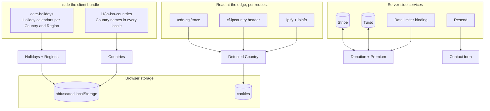

import { APP_LOCALES } from '../../../components/demos/HowItWorksDemo';

The planner needs surprisingly little data, and most of it never crosses the network: the Holiday calendars and the Country list ship inside the client bundle. This page lists every source, what reads it, how it is cached and what happens when it fails.

## Holidays

| | |
| --- | --- |
| Source | The `date-holidays` package, a curated database of public holidays per country and subdivision, with rules for moveable dates and translated names |
| Adapter | `dateHolidaysSource` in `apps/web/src/infrastructure/services/holidays/source/dateHolidays.ts`, the **only** place in the app that constructs the package |
| Entry point | `getHolidays` in `apps/web/src/infrastructure/services/holidays/getHolidays.ts`, called from the holidays store through a dynamic `import()` |
| Runs | In the browser. The data is bundled, so a lookup is synchronous and offline-capable |
| Scope | The chosen year **and the next one**, because Carry-over Months reach into it. Looked up twice: once for the Country, once for the Country plus Region, so a Region's own calendar can add Holidays and drop national ones it does not observe |
| Kept | Only entries whose upstream `type` is `public` or `bank`, the two classifications that mean the user does not work (`keepNonWorking` in `apps/web/src/infrastructure/services/holidays/source/utils/nonWorking.ts`). Observances, school holidays and optional days are discarded |
| Shape | `HolidayDTO` from `apps/web/src/application/dto/holiday/dto.ts`: `id`, `name`, `date`, `variant` (National, Regional, Custom), `location` for Regional entries and `isInPlanningWindow` |
| Language | The locale is passed as `languages: [locale]`, so a Catalan user sees Catalan names where the package has them |
| Failure | Resolves to an empty array and a log entry. The planner shows no Holidays rather than crashing, and the user's Custom Holidays survive |

The upstream word `type` is reserved for that classification; the app's own National/Regional/Custom axis is the **Holiday Variant**, and the glossary keeps the two apart on purpose.

## Countries and Regions

| | Countries | Regions |
| --- | --- | --- |
| Source | `i18n-iso-countries`, with the language files for {APP_LOCALES.length} locales registered at module load (`apps/web/src/infrastructure/services/countries/getCountries.ts`) | The same `date-holidays` adapter: `regionsOf(country)` returns the subdivisions the package knows a calendar for (`apps/web/src/infrastructure/services/regions/getRegions.ts`) |
| Why | Country names have to render in the user's language, and the ISO list is the one the Holiday package keys on | Only a Region with a calendar of its own is worth offering; a list from a geographic database would include Regions that change nothing |
| Runs | In the browser | In the browser |
| Cache | The location store refreshes the list at most once every 24 hours (`TWENTY_FOUR_HOURS` in `apps/web/src/application/stores/utils/crypto.ts`) and persists it | Recomputed synchronously whenever the Country changes; not persisted |
| Ordering | Both go through `collateByLabel` (`apps/web/src/application/shared/utils/collate.ts`), a locale-aware sort, so accented names land where a speaker expects them | Same |
| Failure | Empty list and a log entry | Empty list and a log entry; the Region field disables |

## The visitor's Country

Detected at the edge, on every page request, by three strategies tried in order and described on the [country detection](/how-it-works/country-detection/) page:

| Strategy | Reads | Reflects | Cache |
| --- | --- | --- | --- |
| Cloudflare trace | `GET /cdn-cgi/trace` from inside the Worker | The Worker's egress, which is usually near the visitor and not always | `force-cache`, 5 s timeout |
| `cf-ipcountry` header | A header Cloudflare stamps on the inbound request | The **visitor's** IP, the only strategy that truly does | None needed |
| IP lookup | `api.ipify.org`, then `ipinfo.io` | The Worker's egress again | `force-cache`, 5 s timeout |

The answer is a lowercase ISO 3166-1 alpha-2 code in the `user-country` cookie, valid for a week, readable from JavaScript on purpose. Nothing about it is stored server-side.

## Persisted state

Everything the user configures or the engine produces lives in the browser, in `localStorage`, through Zustand's `persist` middleware:

| Store | Persisted | Notes |
| --- | --- | --- |
| `filters` | Everything except the year | The year resets to the current one on every visit |
| `holidays` | Holidays, the Suggestion, Alternatives, the applied index, Manual and Removed Days | Dates round-trip as ISO strings |
| `location` | Country and Region lists plus the fetch timestamp | Loading flags are not persisted |
| `premium` | The Premium key, email, last verification time | Mirrors the server session; re-verified after 24 hours |
| `ui` | Nothing | Ephemeral popover and currency state |

The values are obfuscated with a build-time key before they hit storage (XOR plus base64), which keeps casual tampering out and is not cryptography ([data protection](/how-it-works/data-protection/) has every primitive the app does apply); [ADR 0007](https://github.com/fbuireu/forever-pto/blob/main/adr/0007-persisted-client-state-is-obfuscated-not-encrypted.md) explains why that is the right amount. Details on the [state stores](/how-it-works/state-stores/) page.

## Server-side data

The server touches data only for a Donation, a Premium session and the contact form. Each is an Effect service behind a `Context.Tag`, wired once in `apps/web/src/infrastructure/layers.ts`:

| Service | What it holds | Read by | Written by |
| --- | --- | --- | --- |
| **Stripe** | The PaymentIntent, which **is** the Premium key; promotion codes | Activation, session recovery, promo validation | `POST /api/payment` |
| **Turso** (libSQL over HTTP) | A payments table mirroring succeeded intents by email; contact submissions | `activateWithEmail` on a new device | Deferred `after()` writes, with the Stripe webhook as the fallback that converges the table if the deferred write died |
| **Resend** | Nothing stored; transactional email | Nothing | The contact form ([emails](/how-it-works/emails/)) |
| **`PAYMENT_RATE_LIMITER`** | A sliding counter per client IP, ten requests per minute, inside Cloudflare's rate-limiting binding | Every payment route before it does anything else | The binding itself |

There is no user table and no session table: a Premium session is a signed JWT in the `premium-token` cookie, and the payment row exists so a returning donor can be recognised by email. [ADR 0008](https://github.com/fbuireu/forever-pto/blob/main/adr/0008-premium-derived-from-payment.md) records that decision.

## Build-time data

Two more values are read when the site is built rather than when it runs:

- The app **version**, from `apps/web/package.json`, rendered in the error page's kicker, passed to the Better Stack tag as the `release`, embedded in the MCP server card, and displayed in this wiki's header.
- The **public environment**, the `NEXT_PUBLIC_*` variables inlined by the build: the site URL that every absolute link and the Cloudflare trace call derive from, the analytics ids and the storage obfuscation key.

## What is never collected

The plan itself, the Manual Days, the Custom Holidays, the budget. None of it leaves the browser unless the user exports it. Analytics events (`payment_completed`, `upgrade_modal_opened` and the rest) carry an amount, a feature id or an outcome, never a date; see [observability](/how-it-works/observability/).
