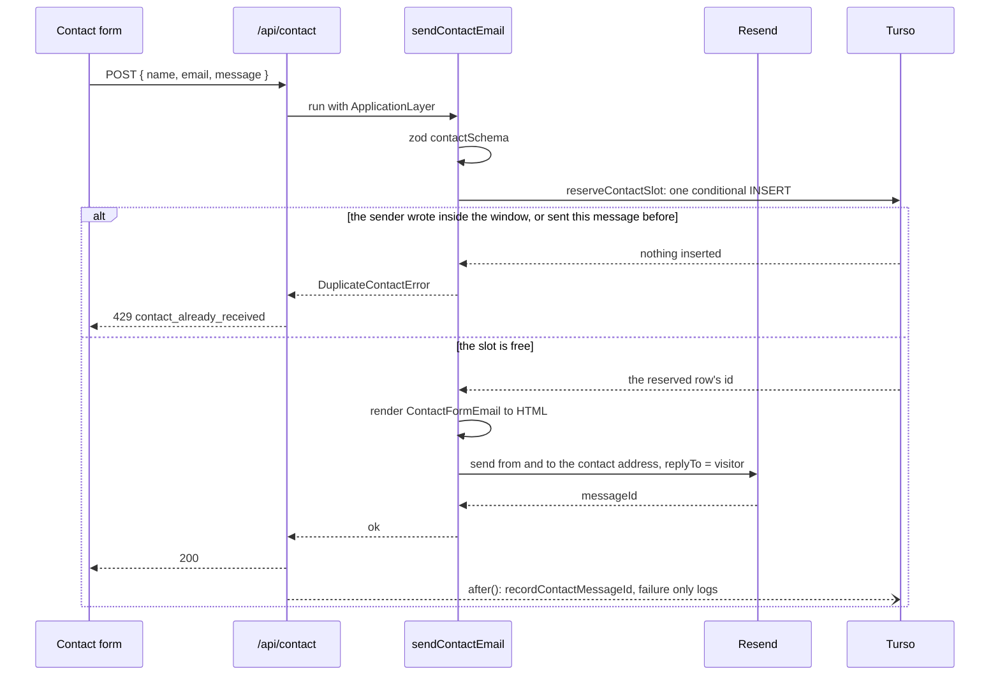

Email is deliberately minimal. There is exactly **one** email in the system today: the contact-form notification. No welcome mails, no receipts (Stripe handles its own), no marketing.

## The stack

- **Resend** as the provider, wrapped in an Effect service (`ResendService`, `apps/web/src/infrastructure/clients/email/resend/service.ts`) that is part of `ApplicationLayer` in `apps/web/src/infrastructure/layers.ts`, the same dependency-injection pattern as Turso and Stripe.
- **react-email** for templates: React components rendered to HTML on the server with the `render` the same `react-email` package exports.

## The contact pipeline

1. The contact form (under `apps/web/src/ui/modules/shared/contact/`) posts to `POST /api/contact` (`apps/web/src/app/api/contact/route.ts`), which pulls `NEXT_PUBLIC_SITE_URL` and `NEXT_PUBLIC_CONTACT_EMAIL` from the Cloudflare context and invokes the use-case.
2. `sendContactEmail` (`apps/web/src/application/use-cases/contact.ts`):
   - Validates the body against `contactSchema` (`apps/web/src/application/dto/contact/schema.ts`); a zod failure returns 400 with the message.
   - Holds the sender's slot in the Turso `contacts` table with `reserveContactSlot` (`apps/web/src/infrastructure/services/contact/repository.ts`): one conditional `INSERT` that writes the row only when the same sender has written nothing inside the cooldown and never sent this message. The database evaluates it atomically, so two submissions at the same moment send one email, and the other answers 429 with the same `cooldown` or `repeated` reason a later one would.
   - Renders `ContactFormEmail` (`apps/web/src/application/email/templates/Contact.tsx`) to HTML.
   - Sends via Resend **from and to** the configured contact address, with the site visitor's address as `replyTo`, so replying in the mail client goes straight to the user, and a `category=web_contact_form` tag for filtering in the Resend dashboard.
3. **Deferred persistence**: Resend's `messageId` is recorded on the reserved row (`recordContactMessageId`). Like the payment save, this runs after the response via `next/server`'s `after()`, and a DB failure only logs, because the user's message was already delivered.

Render or send failures map to typed errors (`EmailError` → 500) and delete the reserved row, so the visitor can send again; the release is logged at `warn`, or at `error` when the row cannot be deleted. Every log line carries the email domain only, never the full address; see [observability](/how-it-works/observability/).

## Adding a new email

The seams are already in place: add a template under `apps/web/src/application/email/templates/`, a use-case that renders and sends through `ResendService`, and provide `ApplicationLayer` at the route. Keep the pattern of deferring any DB write with `after()` and tagging the send with a `category`.
