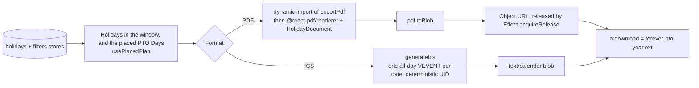

Users can take their plan with them as a printable **PDF** or an **ICS** file that imports into Google Calendar, Outlook and Apple Calendar. Both live behind the premium gate.

## The component

`apps/web/src/ui/modules/sidebar/components/CalendarExport.tsx` (a sidebar tool, tutorial anchor `data-tutorial='calendar-export'`) reads `year` from the filters store, the Holidays inside the Planning Window from the holidays store, and the PTO Days through `usePlacedPlan` (`apps/web/src/ui/hooks/usePlanReadout.ts`): the applied plan, `currentSelection ?? suggestion`, with the Manual Days added and the Removed Days struck, so the file carries what the calendar shows. That hook does not subscribe to `isCalculating`, so a calculation starting and ending does not redraw the tool. Two toggle buttons choose what to include: holidays, PTO days, or both; the download buttons disable when the resulting selection is empty.

The download buttons, and only the buttons, are wrapped in `PremiumFeature` (`apps/web/src/ui/modules/premium/PremiumFeature.tsx`), so free users see the tool blurred with a lock and get the Premium modal on interaction. See [premium](/how-it-works/premium/).

## PDF export

The PDF path is fully lazy: neither the Effect runtime, nor `@react-pdf/renderer`, nor the document component is in the sidebar's bundle. On the first click, inside a React transition, the component dynamic-imports `exportPdf` from `apps/web/src/ui/modules/export/exportPdf.tsx`, the module that holds the whole Effect program. `CalendarExport.tsx` imports nothing from `effect` itself, which its test asserts against the source, because a static import there would put the runtime back in the planner's first load for a button most visits never press. `pdfExportEffect` then dynamic-imports the renderer and the document, renders `HolidayDocument` (`apps/web/src/ui/modules/export/HolidayDocument.tsx`) to a blob with `renderer.pdf(...).toBlob()`, and triggers a download named `forever-pto-{year}.pdf`.

Details worth copying elsewhere:

- The object URL is managed with `Effect.acquireRelease` + `Effect.scoped`, so `URL.revokeObjectURL` runs even on failure, with no leaked blob URLs.
- All labels (`pdf.holidays`, `pdf.vacationDays`, ...) are passed in from the `calendarExport` i18n namespace; the document component itself stays translation-agnostic.

Success and failure surface as `sonner` toasts.

## ICS export

`generateIcs` (`apps/web/src/application/export/generateIcs.ts`) is a small hand-rolled generator with no calendar dependency. Each holiday and each PTO day becomes an all-day `VEVENT` (`DTSTART;VALUE=DATE` / `DTEND` next day) with a `CATEGORIES` of `HOLIDAY` or `PTO` and a deterministic `UID` (`holiday-{id}@forever-pto`, `pto-{yyyymmdd}@forever-pto`). Summaries pass through `sanitize` (`apps/web/src/application/export/utils/sanitizer.ts`) to escape ICS-reserved characters, lines join with `\r\n` per RFC 5545, and the calendar carries a localized `X-WR-CALNAME` plus the year. The component wraps the string in a `text/calendar` blob and downloads it as `forever-pto-{year}.ics`.

Because UIDs are deterministic, re-importing a regenerated file updates events in place in most calendar clients instead of duplicating them.

## Testing

`apps/web/src/application/export/generateIcs.test.ts` covers the generator; the PDF path is exercised through the component tests in `apps/web/src/ui/modules/sidebar/components/CalendarExport.test.tsx`, which also hold the static-import rule above.
