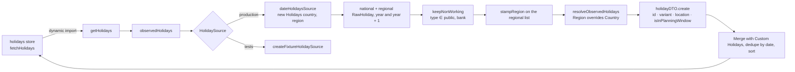

import { StrategiesTable } from '../../../components/demos/HowItWorksDemo';

Two layers cooperate here: an infrastructure service that **fetches** Holidays, and a pure domain engine (`apps/web/src/domain/calendar/`) that **computes** what to do with them. This page is about the first half, up to the moment a `HolidayDTO[]` reaches the store. The [planning algorithm](/how-it-works/planning-algorithm/) page takes over from there.

## Fetching

`getHolidays` in `apps/web/src/infrastructure/services/holidays/getHolidays.ts` is the whole public API: `getHolidays({ year, country, carryOverMonths, region, locale })` returns a `Promise<HolidayDTO[]>`. Without a `country` it answers `[]` at once, which is the normal first call rather than an error: the planner renders before a Country has been detected or chosen.

The production adapter, `dateHolidaysSource` in `apps/web/src/infrastructure/services/holidays/source/dateHolidays.ts`, is the **only** place in the app that constructs the `date-holidays` package. It looks up the chosen year **and the next one**, because Carry-over Months reach into it, and it does so twice: once for the Country alone and once for the Country plus Region. The locale is passed as `languages: [locale]`, so the names come back translated where the package has a translation.

It runs in the browser. The only caller is `fetchHolidays` in the [holidays store](/how-it-works/state-stores/), through a dynamic `import()`, so the package and its data ship in the client bundle and a lookup is a synchronous library call, offline-capable and free of any network round trip. That is a consequence of [ADR 0001](https://github.com/fbuireu/forever-pto/blob/main/adr/0001-planner-runs-in-the-browser.md), and it means nothing in this folder may touch a Node or Cloudflare API.

## The rules, above the seam

The adapter returns raw lookups and nothing else; the rules run **above** it, in `observedHolidays` (`apps/web/src/infrastructure/services/holidays/source/observedHolidays.ts`), so the test adapter goes through exactly the same ones:

1. **Only days the user does not work count.** The package classifies every entry with a `type`, and only `public` and `bank` mean the user does not work (`keepNonWorking` in `apps/web/src/infrastructure/services/holidays/source/utils/nonWorking.ts`). Observances, school holidays and optional days are discarded here and never reach the planner.
2. **Regional entries are stamped.** `stampRegion` writes the Region code onto each entry of the regional lookup as `location`, which is what later tells National from Regional.
3. **The Region overrides the Country.** `resolveObservedHolidays` (`apps/web/src/infrastructure/services/holidays/source/utils/observed.ts`) lets a Region's calendar add Holidays the Country does not have **and drop** national ones it does not observe, which is the difference between "Region as a filter" and "Region as a calendar".

The seam used to sit one level higher, with the filter inside the production adapter only; the fixture then had to hand-write the filtered shape, and deleting the filter left the end-to-end test green. `apps/web/src/infrastructure/services/holidays/CLAUDE.md` records that move.

## The shape

`holidayDTO.create` in `apps/web/src/application/dto/holiday/dto.ts` maps each surviving raw entry to a `HolidayDTO`:

| Field | Value |
| --- | --- |
| `id` | `national-<date>` or `regional-<date>`; stable across refetches, which is what the calendar keys on |
| `name` | The translated name |
| `date` | A `Date` at local midnight, parsed as an upstream calendar day rather than an instant |
| `type` | The upstream classification, kept for reference and never read by the planner |
| `variant` | `HolidayVariant.REGIONAL` when `location` is set, `NATIONAL` otherwise, `CUSTOM` for user-created ones |
| `location` | The Region's human-readable name, resolved from the Region list rather than the raw code |
| `isInPlanningWindow` | Whether the date falls in the year plus its Carry-over Months; Holidays outside it are still shown for context but cannot anchor a Bridge |

Two entries on the same date collapse to one, with the Regional one winning, which is why the mapper sorts regional entries after national ones before deduplicating. The Region **list** the mapper needs to render a label is derived inside `getHolidays` from the same adapter (`getRegions` in `apps/web/src/infrastructure/services/regions/getRegions.ts`), not passed in: it used to arrive from the location store, populated by a different component's effect, and whenever this ran first the label stayed a raw code for the rest of the session.

## Custom Holidays

User-created Holidays never pass through the fetch. The store builds them with `holidayDTO.createCustom`, keeps them across every refetch, recomputes their `isInPlanningWindow` for the new window, and drops any fetched Holiday that falls on the same date, so a Custom Holiday outranks a National or Regional one as the glossary says it must. Adding or editing one asks `heldOn` whether the date is already taken and by what, and answers a `HolidayOutcome` the [Holiday form](/how-it-works/planner-ui/#the-holiday-tables) turns into copy.

## Failure

Errors resolve to an empty array and a log entry, in the service and again in the store, which then keeps only the Custom Holidays. The planner degrades to a calendar with weekends and the user's own Holidays rather than crashing, and the Region field disables when the Country has no Regions to offer.

## From here to the engine

The store hands the merged list to the [calculation worker](/how-it-works/calculation-worker/) as `SerializedHolidayDTO[]`, dates as ISO strings, and the worker deserialises them for `runPlanningPipeline`. What the engine does with them, Bridge by Bridge, is the [planning algorithm](/how-it-works/planning-algorithm/) page; the three Strategies it can apply are:

<StrategiesTable />
