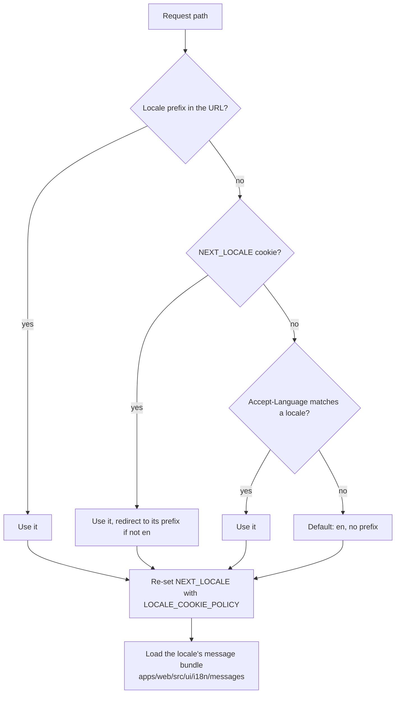
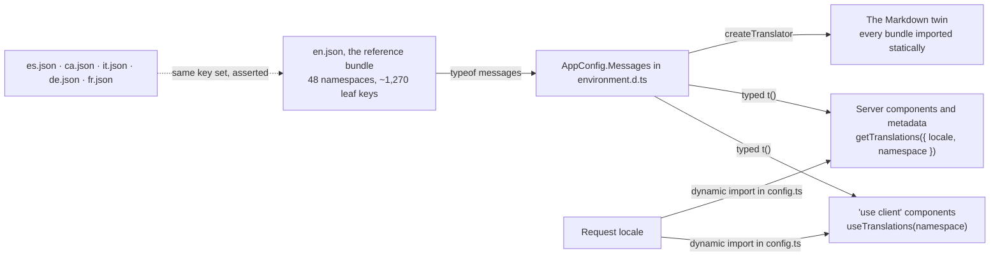

import { APP_LOCALES } from '../../../components/demos/HowItWorksDemo';

The app is localized with `next-intl`. The supported locales are defined once in `apps/web/src/infrastructure/i18n/locales.ts` and imported below directly from that file, so this list cannot drift: <span>{APP_LOCALES.map((locale) => <span key={locale}><code>{locale}</code>{' '}</span>)}</span> ({APP_LOCALES.length} locales).



## Routing

`apps/web/src/infrastructure/i18n/routing.ts` calls `defineRouting` with:

- `locales: LOCALES`, `defaultLocale: EN`.
- `localePrefix: 'as-needed'`. English lives at `/`, every other locale gets a prefix (`/es/...`, `/ca/...`).
- `localeCookie: { secure: true, sameSite: 'lax' }`.

The `next-intl` middleware (`createMiddleware(routing)` in `apps/web/src/middleware.ts`) resolves the locale per request. Unknown locales hit `notFound()` in the root layout, which renders `generateStaticParams` over all locales.

## The NEXT_LOCALE cookie

`next-intl` persists the resolved locale in the `NEXT_LOCALE` cookie (constant `LOCALE_COOKIE` in `apps/web/src/infrastructure/i18n/locales.ts`). The proxy then **re-sets** that same cookie through `setLocaleCookie()` (`apps/web/src/infrastructure/i18n/cookie.ts`), which applies `LOCALE_COOKIE_POLICY`: `secure: true`, `sameSite: 'lax'`, `path: '/'`, and no `maxAge` (a session cookie). It is **not** `httpOnly`: the same policy object goes to next-intl from `routing.ts`, and the client-side language switcher writes the cookie from `document.cookie`, so a server-only cookie would break every soft locale switch. See [cookies](/reference/cookies/).

## Messages

- Catalogs live in `apps/web/src/ui/i18n/messages/{locale}.json`, one file per locale (aliased as `@i18n/*`).
- `next.config.ts` wires them via `createNextIntlPlugin` pointing `requestConfig` at `apps/web/src/infrastructure/i18n/config.ts`, with the experimental `messages` option (path `./src/ui/i18n/messages`, locales inferred, precompiled).
- `apps/web/src/infrastructure/i18n/config.ts` is the request config: it validates the requested locale with `hasLocale`, falls back to `routing.defaultLocale` and dynamically imports the matching JSON.
- `environment.d.ts` augments the `next-intl` `AppConfig` interface so message keys are fully typed against the English catalog.

## Navigation wrapper

App code never imports `Link` or `useRouter` from `next/link` / `next/navigation` directly. `apps/web/src/application/i18n/navigation.ts` exports locale-aware versions:

```ts
import { createNavigation } from 'next-intl/navigation';
import { routing } from '@infrastructure/i18n/routing';

export const { Link, usePathname, useRouter } = createNavigation(routing);
```

Everything imports these from `@application/i18n/navigation`, so hrefs stay locale-prefixed automatically.

## The life of a key



1. **`en.json` is the reference.** `environment.d.ts` augments next-intl's `AppConfig` with `Messages: typeof messages` read off the English bundle, so every `t('...')` call is typed against it: a key that does not exist is a compile error, and so is a namespace that does not.
2. **A component reads one namespace at a time.** `useTranslations('sidebar')` in a client component, `getTranslations({ locale, namespace })` in a server one; a component that needs two namespaces calls the hook twice rather than reaching across. Namespaces map to a surface, not to a component tree, so `pages/planner/Contact.tsx` reads `roadmap` and the contact form reads `contact`.
3. **`core/` components never translate.** They may not call `useTranslations`, so every accessible name a primitive needs (`closeDialog`, `toggleSidebar`, `closeToast`) is a prop the caller supplies out of the `a11y` namespace, the one namespace that holds names rather than copy.
4. **The bundle for a request is loaded once**, by `apps/web/src/infrastructure/i18n/config.ts`: it validates the locale with `hasLocale`, falls back to the default, and dynamically imports the matching JSON. The Markdown twin cannot do that (it runs where `next-intl/server` is unavailable) and imports every bundle statically into a `Record<LocaleCode, …>`, so a seventh locale without a row fails to compile.
5. **Every other bundle must have exactly the keys `en.json` has.** `tests/docs-consistency.test.ts` compares key sets in both directions, so a key added to English and forgotten in Catalan fails the app's own CI. It compares *sets*, not values, so a stale translation is invisible to it; and it separately fails on any string written in capitals outside a named acronym allow-list, because uppercase is a CSS class here, never copy.
6. **Machine-code keys stay snake_case.** `toasts.promoCodeErrors.*` mirrors Stripe's promotion-code error codes and `contact.errors.*` mirrors `ApiError`, looked up by a value that arrives from elsewhere; a missing key falls back to the namespace's generic message, which is why adding a reachable code means adding its key in the same change.

## Switching language

The sidebar's `LanguageSelector.tsx` and the homepage's `HomepageLanguageSwitcher.tsx` both go through `useLanguageSwitch` (`apps/web/src/ui/hooks/useLanguageSwitch.ts`): it calls the locale-aware `router.push(pathname, { locale })`, so the user stays on the same page under the new prefix, and next-intl writes `NEXT_LOCALE` from `document.cookie` on the way. That client-side write is the reason the cookie is not `httpOnly` and why its attributes are stated once in `LOCALE_COOKIE_POLICY` for both writers. The list of languages and their labels comes from `useLanguages`, which reads the `languages` namespace, so a locale without a label there is a compile error too.

## Adding a locale

1. Add the code to `LOCALES` in `apps/web/src/infrastructure/i18n/locales.ts`; `Locale`, `generateStaticParams`, the sitemap's alternates and the JSON-LD's `availableLanguage` all derive from it.
2. Add `apps/web/src/ui/i18n/messages/<code>.json` with every key of `en.json`; the parity rule fails until it is complete.
3. Add the row to `MESSAGES` in `apps/web/src/infrastructure/markdown/buildMarkdownPage.ts` and the `languages.<code>` label in every bundle; both are compile errors until done.
4. Register the `i18n-iso-countries` language file in `apps/web/src/infrastructure/services/countries/getCountries.ts`, or Country names render in English for that locale.
5. Nothing else: routing, the cookie, the proxy and the wiki's own locale interpolation all read the constant.

## Conventions

- Components use namespaced hooks: `useTranslations('sidebar')`, `useTranslations('donate')`, `useTranslations('tutorial.steps')`. Cross-namespace access means multiple hooks, not one giant namespace.
- Translation strings never contain ALL-CAPS text; uppercase is applied with CSS in the component.
- Server code uses `getTranslations({ locale, namespace })`; see the [markdown API](/how-it-works/markdown-api/) and [SEO](/how-it-works/seo/) pages for examples.
