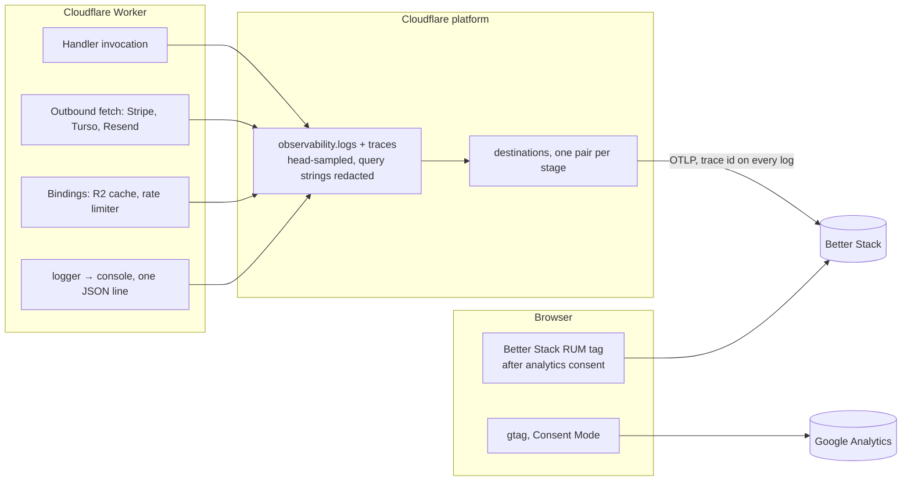
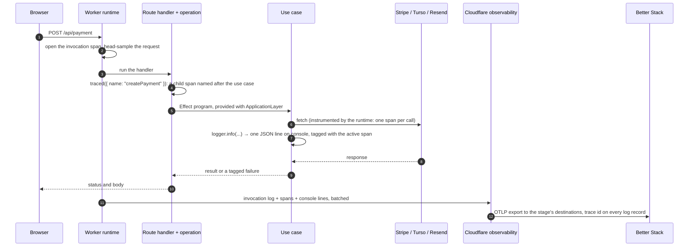

Telemetry converges on **Better Stack**, fed from several surfaces: the Cloudflare platform, the server runtime, the browser, plus Google Analytics for product metrics. Nothing in the app opens a connection to it. The server side writes to `console` and Cloudflare exports; the browser side is a tag.



## One request, end to end



Nothing in the app opens a connection to a telemetry backend. The runtime instruments the handler, the outbound `fetch` calls and the binding calls on its own; `traced` in `apps/web/src/infrastructure/span.ts`, called by each operation under `apps/web/src/infrastructure/api/operations/`, adds one named span per entry point (`createPayment`, `sendContactEmail`, `activatePremium`) so a trace reads the operation rather than `POST`; `logger` writes one JSON line per call to `console`; and the platform ships all of it to the destinations `wrangler.toml` names. The browser side is a tag, loaded only after consent.

## The signals

| Signal | Produced by | Sampling | Lands in | Correlated by |
| --- | --- | --- | --- | --- |
| Invocation log | The runtime, per request: URL (query string redacted), method, status, outcome, duration | `head_sampling_rate` in `wrangler.toml`, the same in every environment | Cloudflare Workers Logs and, through the `destinations` entry, Better Stack | The invocation's trace id |
| Spans | The runtime: the invocation, each `fetch`, each binding call; plus one named span per entry point from `traced` | The same rate, decided once per request | Cloudflare Traces and Better Stack | Parent and child ids the runtime nests itself |
| Application log lines | `logger.info`, `warn`, `error` and `logError`: one `JSON.stringify` line to `console[level]` | Follows the invocation: a sampled-out request exports none of its lines | Same as the invocation log | The trace id of the span active when the line ran, attached by the runtime |
| Browser errors, session replays, web vitals | The Better Stack RUM tag, after the analytics consent | Configured remotely in Better Stack | Better Stack, under the app version as `release` and the hostname-derived environment | Session |
| Product events | `track()` over `window.betterstack`, a closed union of event names | None | Better Stack | Session, plus `identifyUser` for Premium users |
| Page analytics | `gtag` with Consent Mode, `analytics_storage` granted only after opt-in | None | Google Analytics, one measurement id shared with the wiki | GA session |

## What a log line looks like

Every application line is the same shape, written by `write` in `apps/web/src/infrastructure/logging/logger.ts`:

```json
{"ip":"203.0.113.9","reason":"rate_limit_exceeded","service":"forever-pto-web","level":"warn","message":"Payment request refused"}
```

Three things about it are deliberate. The caller's context is spread **first**, so a context carrying its own `level` or `service` cannot relabel the line; `service` is `LOG_SERVICE`, the same value contribKit's logger writes, so the two sinks answer the same query; and a `url` in the context has its query string removed by `stripQuery` before serialisation, because Stripe appends the client secret to the return URL. The whole call sits in a `try` that returns, so a circular reference or a `BigInt` in a context cannot take down the Zustand action or the payment handler that was logging.

There is no `debug` level and no request-scoped transport: the levels are `info`, `warn` and `error`, indexed by the contract's own union so a level `console` has no method for fails to compile, and the line reaches the sink through the platform rather than through a batcher the Worker owns. [ADR 0018](https://github.com/fbuireu/forever-pto/blob/main/adr/0018-the-platform-is-the-log-transport.md) records why the batcher went: as a module-level instance it delivered request B's lines from a timer armed in request A, which workerd refuses as I/O on behalf of a different request.

## Where the configuration lives

| Setting | Where | Notes |
| --- | --- | --- |
| Whether logs and traces are collected, the sampling rate, query-string redaction | `[observability]` in `wrangler.toml`, restated per environment | The contract suite asserts every environment restates the same values |
| Where they are exported | `destinations = [...]` in the same blocks, one pair per stage | A destination is an account-level object in the Cloudflare dashboard: an OTLP endpoint and its headers. The repository names it and holds no credential for it |
| The Better Stack source token for the export | The destination, in the dashboard | Reissuing the source is a dashboard edit; no deploy |
| The browser tag's token | `NEXT_PUBLIC_BETTER_STACK_TRACKING_TOKEN`, a GitHub environment variable inlined by the build | The last Better Stack value the build reads |
| The Google Analytics id | `GOOGLE_ANALYTICS_ID`, one repository variable mapped to `NEXT_PUBLIC_` for the app and `PUBLIC_` for the wiki | Shared on purpose: one session across both subdomains |

## Cloudflare Workers observability

`wrangler.toml` enables platform observability for the worker in every environment: invocation logs and traces, both head-sampled (see the `[observability]` blocks in the file for the current rates), with `redact_query_string` on so a request URL reaches no sink with its query string attached.

That is not only the Cloudflare dashboard's copy. `[observability.logs]` and `[observability.traces]` each name a `destinations` entry, and a destination is an OTLP endpoint plus its headers, configured in the Cloudflare dashboard. The platform batches the events and posts them there itself, so Better Stack receives the same logs and spans the dashboard shows and nothing in the repository carries them.

A destination belongs to the Cloudflare **account**, not to a Worker: it is created once and referenced by bare name from any `wrangler.toml`. It has no environment of its own either, so each stage of the app names its own pair (`forever-pto-web-production-traces` against the live Better Stack source, `forever-pto-web-development-traces` against the other), and the top level names production's because it shares production's worker name and variables. Naming another stage's destination would not fail: the events would arrive, filed with the live site's, distinguishable only by script name. The spelling is repo, package, stage, signal, matching the [GitHub environments](/infra/environments/) and the release tags.

## Request traces

Tracing is automatic and there is no tracing code in the tree. The runtime instruments handler invocations, outbound `fetch` calls (Stripe, Turso, Resend) and **binding** calls (the R2 incremental cache, the payment rate limiter) on its own, nests them correctly, and attributes `console.*` output to the span that was active when it ran. Exported log records carry the trace id of that span, so a log line and the span it failed on answer one query without the app stamping anything.

The Worker entrypoint is `.open-next/worker.js`, exactly what OpenNext generates. It used to be a hand-written wrapper module around that handler, instrumenting it with `@microlabs/otel-cf-workers` and shipping OTLP itself, because at the time the platform exported traces nowhere. [ADR 0017](https://github.com/fbuireu/forever-pto/blob/main/adr/0017-observability-is-the-platform-export.md) records why that was removed, including the measurement that decided it: the library's `instrumentEnv` has no R2 branch, so the binding the app leans on hardest produced no span at all, while the native instrumentation covers it.

Every use case under `apps/web/src/application/use-cases` still ends in `Effect.withSpan`, and nothing consumes those calls today. Effect's tracer interface needs a span id and a trace id on a span constructed synchronously, and the runtime's span API exposes neither and hands spans out only inside a callback, so the bridge that used to connect them cannot be repointed. The calls stay because they cost nothing, they mark each use case's boundary, and they are what a future bridge would attach to.

## Server-side logging

- `apps/web/src/infrastructure/logging/logger.ts` exports `logger`, the object plain code uses directly ([country detection](/how-it-works/country-detection/), stores, services): `info`, `warn`, `error` and `logError`, each taking one `{ message, context }` object. Under it there is no SDK and no HTTP call: `write` sends one JSON line to the `console` method of the level, and the platform export above carries it. The spread order inside that line is load-bearing, with the caller's context first, so a caller cannot relabel its own level, message or service; the tests pin all three. It is the same object, the same line and the same file path contribKit's logger has, so the two sinks can be queried the same way.
- That is what puts a trace id on the app's own log lines. It did not for one release: the client held a `@logtail/edge` transport and posted over HTTP from inside the Worker, which the runtime cannot see, so spans and logs both arrived and nothing joined them. See [ADR 0018](https://github.com/fbuireu/forever-pto/blob/main/adr/0018-the-platform-is-the-log-transport.md), which also records the price: the fields are serialised here and parsed back out of the JSON body by the sink, rather than handed over as an object.
- Every entry has its `url` field stripped of its query string by `stripQuery`, because Stripe appends `payment_intent_client_secret` to the return URL. That is a different guarantee from `redact_query_string` above, which covers the request URL the platform records rather than a field a caller passes in a log context.
- In the browser the same client writes to the browser console, which reaches Better Stack only through the RUM tag below and only after analytics consent. Before this it posted over HTTP regardless of consent.
- `apps/web/src/infrastructure/logging/service.ts` holds `LoggerService`, the Effect tag used inside use-cases; it resolves to that same `logger` object and is part of `ApplicationLayer`.

A privacy convention runs through all call sites: log the email **domain**, ids and flags, never full addresses or payloads.

## Browser analytics: typed `track()`

`apps/web/src/infrastructure/clients/logging/better-stack/tracking.ts` exposes `track({ event, properties })` and `identifyUser({ email, plan })` over `window.betterstack`. Event names are a closed union (`TrackEventName`): `payment_started`, `payment_completed`, `payment_failed`, `promo_code_applied`, `premium_activated`, `upgrade_modal_opened`, `feature_unlocked`, `planner_generated`, `contact_form_submitted`, so a typo or ad-hoc event is a compile error. Both functions no-op when the script is absent (SSR, consent denied).

The script itself is injected by `apps/web/src/ui/modules/tracking/BetterStackTracking.tsx`, mounted in the root layout but rendering nothing until the analytics [consent category](/how-it-works/cookie-consent/) is accepted and `NEXT_PUBLIC_BETTER_STACK_TRACKING_TOKEN` is set. Once consented, premium users are identified with `identifyUser({ email, plan })`, where `plan` is `'premium' | 'free'`.

That snippet is Better Stack's real user monitoring tag, not only an event pipe: once loaded it also captures browser errors, session replays, web vitals and console logs, and which of those run, at what sampling, is configured remotely in the Better Stack application, so a change there needs no deploy. Two things are set from code because the tag cannot know them. The **release** is the app version from `apps/web/package.json`, passed through `betterstack('config', { release })`, so an error is grouped under the version that produced it. The **environment** is derived from the hostname by `trackingEnvironment(hostname)`: `localhost` and any `.workers.dev` host, which is where a pull-request preview lives, report `development`, everything else `production`. It used to read `NODE_ENV`, which every deployed build sets to `production`, so preview traffic was filed with the live site's.

## The wiki

`docs.forever-pto.com` has no observability and cannot have any: its `wrangler.toml` declares no `main`, so Cloudflare serves the built assets without invoking a script, and there is no handler invocation, outbound `fetch` or binding call to trace. What it does have is browser-side analytics behind its own consent banner, with its own Better Stack RUM source and the same Google Analytics measurement id the app uses. Both are described on the [cookie consent](/how-it-works/cookie-consent/) page.

Read every browser-side figure as a floor. Better Stack RUM is Sentry's browser SDK underneath and posts to a Sentry `envelope` endpoint that ad blockers filter aggressively, and GA4 fares no better. The only numbers nothing can block are Cloudflare's own request analytics.

## Google Analytics

`apps/web/src/ui/modules/tracking/Analytics.tsx` loads gtag (`NEXT_PUBLIC_GOOGLE_ANALYTICS_ID`) with **Consent Mode defaults of denied** for all storage types; the consent component upgrades `analytics_storage` only after opt-in. GA covers acquisition/product analytics; Better Stack events cover behavioral telemetry the team actually alerts on.

## Where to look when debugging

- Request failed in production → Better Stack (exported invocation logs carry URL, method, status and outcome, plus the trace id of the request's span).
- Effect use-case errors → Better Stack via `LoggerService` with structured context.
- Client-side behavior funnels → Better Stack events; page analytics → GA.
