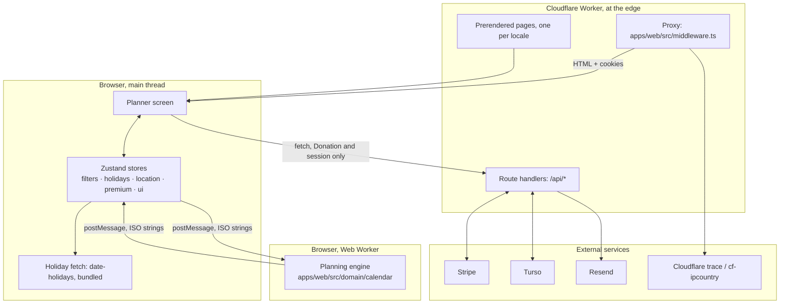
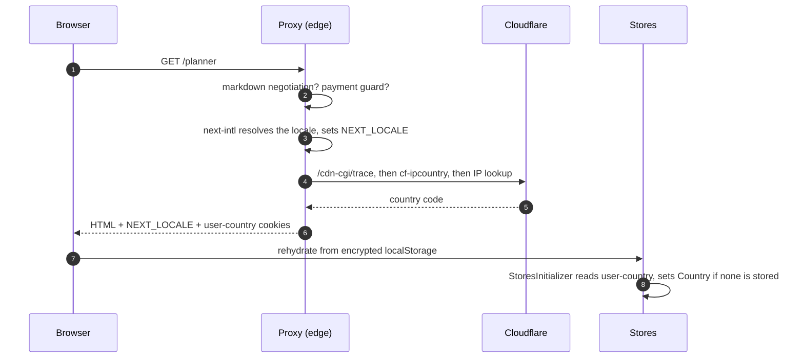
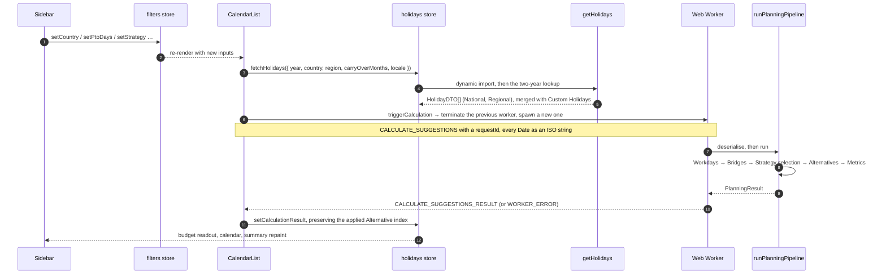

The planner is a browser application with a thin server in front of it. This page is the map: which piece runs where, in what order, and what crosses each boundary. Every step links to the page that covers it in depth.

## The runtimes

There are three places code runs, and they never share memory:

- **The Worker** serves prerendered HTML, runs the [proxy](/architecture/proxy/) on every page request and hosts the API routes. It never sees a plan.
- **The main thread** holds the stores, renders the planner and fetches Holidays. The Holiday data ships in the client bundle, so "fetch" here is a library call, not a network request.
- **The Web Worker** runs the engine. It receives plain data and returns plain data; it has no access to the DOM or the stores.

## The first request

1. The [proxy](/architecture/proxy/) runs its chain: Markdown negotiation for agents, the payment-confirmation guard, locale resolution and, last, [country detection](/how-it-works/country-detection/). The result is two cookies and a prerendered page.
2. The browser rehydrates the five [stores](/how-it-works/state-stores/) from `localStorage`. Every persisted store revives its dates from ISO strings and wipes its own key when the blob is corrupt.
3. `StoresInitializer` (`apps/web/src/ui/modules/stores/StoresInitializer.tsx`) reads the `user-country` cookie and seeds the filters store's Country, only when the user has never chosen one.

## The planning loop

Everything after that is one loop, closed inside the browser. `CalendarList` (`apps/web/src/ui/modules/pages/planner/CalendarList.tsx`) owns it: one effect refetches Holidays when the Country, Region, year or Carry-over Months change, and a second one triggers a calculation when any planning input changes or the store bumps its `planRevision`.

- **Holidays** come from the `date-holidays` package, looked up for the chosen year and the next, once for the Country and once for the Region, then filtered to non-working types and shaped into `HolidayDTO`. The [holidays engine](/how-it-works/holidays-engine/) page has the rules; [data sources](/how-it-works/data-sources/) has the provenance.
- **The worker** is spawned fresh for every calculation and the previous one is terminated, because the handler is synchronous and `terminate()` is the only real cancellation. The [calculation worker](/how-it-works/calculation-worker/) page covers the protocol.
- **The engine** is `runPlanningPipeline` in `apps/web/src/domain/calendar/pipeline.ts`: clear the caches, expand the Planning Window into months, fold Manual Days in as pseudo-Holidays, measure the Remaining Budget, find Workdays and Bridges, select under the Strategy, build Alternatives, measure everything. The [planning algorithm](/how-it-works/planning-algorithm/) page walks each stage.
- **The result** lands in the holidays store, and every planner component reads it back from there: the calendar paints Suggested, Manual and Alternative days, the panel shows the budget and the Alternative switcher, the Summary renders the Metrics. The [planner UI](/how-it-works/planner-ui/) page maps the screen.

## What each boundary carries

| Boundary | Carries | Never carries |
| --- | --- | --- |
| Edge → browser | HTML, `NEXT_LOCALE`, `user-country` | Any planning input or output |
| Store → `localStorage` | Filters, Holidays, the Suggestion, Alternatives, Manual and Removed Days, all dates as ISO strings, obfuscated with a build-time key | The year (it resets on every visit), loading flags |
| Main thread → worker | `CalculateSuggestionsRequest`: window, budget, serialised Holidays, Strategy, locale, Manual and Removed Days as ISO strings | `Date` objects, store references |
| Worker → main thread | `WorkerResponse`: a measured Suggestion and its Alternatives, or a stringified error, echoing the `requestId` | Anything for a stale `requestId` (the hook drops it) |
| Browser → API | A Donation intent, a session check, a contact message | The plan |

The one-way arrows are the design. A plan is never uploaded, so the server cannot lose it, leak it or need an account to attach it to; the cost is that a plan lives in one browser unless the user exports it, which is what the [ICS and PDF exports](/how-it-works/exports/) are for.

## Server-side flows

The API routes exist for the parts a browser cannot do alone, and each has its own page:

| Flow | Entry | Page |
| --- | --- | --- |
| Donation and Premium activation | `POST /api/payment`, `GET /api/payment/activate`, `POST /api/webhooks/stripe` | [Premium](/how-it-works/premium/) |
| Premium session | `GET`/`POST /api/check-session` | [Premium](/how-it-works/premium/#the-session-premium-token-cookie) |
| Contact form | `POST /api/contact` | [Emails](/how-it-works/emails/) |
| Agent-facing renditions | `Accept: text/markdown`, `/.well-known/*` | [Markdown API](/how-it-works/markdown-api/), [WebMCP](/how-it-works/webmcp/) |
| Abuse control on the payment routes | The `PAYMENT_RATE_LIMITER` binding | [Rate limiting](/how-it-works/rate-limiting/) |
| Telemetry: invocation logs, spans, the app's own log lines, the browser tag | The platform export named in `wrangler.toml`; nothing in the app opens a connection | [Observability](/how-it-works/observability/) |

All of them are Effect programs provided with one `ApplicationLayer`; see [Effect layers](/architecture/effect-layers/).
