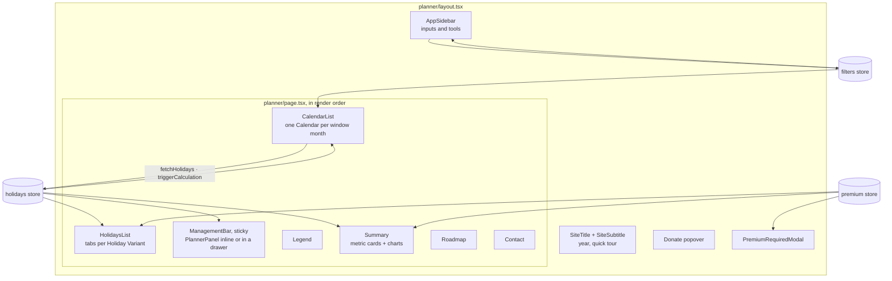
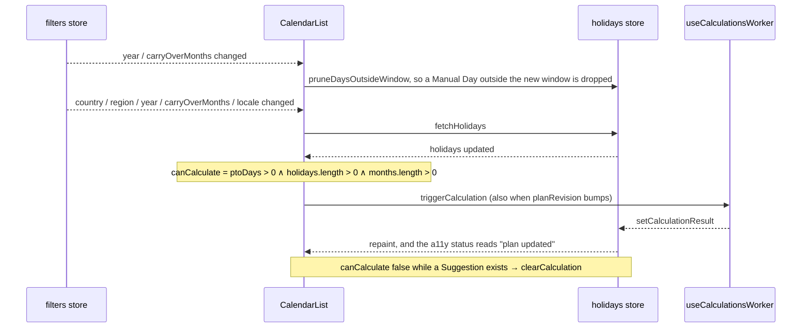

The planner is one route, `apps/web/src/app/[locale]/(app)/planner/page.tsx`, whose layout adds the sidebar and whose body stacks seven `dynamic()`-imported sections. Nothing on the screen computes a plan: every section reads the [holidays store](/how-it-works/state-stores/) and one of them, `CalendarList`, is the only thing that asks for a recalculation.

## The sidebar

`AppSidebar` (`apps/web/src/ui/modules/sidebar/AppSidebar.tsx`) is a server component that renders the shell and streams the client fields into it. It is built on the design system's `Sidebar` (`apps/web/src/ui/modules/core/animate/base/Sidebar.tsx`), collapsible to an icon rail, with the open state persisted in a cookie. Every field writes to the [filters store](/how-it-works/state-stores/) and nothing else; the loop below does the rest.

| Group | Field | Component | Writes |
| --- | --- | --- | --- |
| Steps 1–4 | Country | `Countries.tsx` (server) → `CountriesClient.tsx`, a `Combobox` over the [Country list](/how-it-works/data-sources/) | `country`, which also resets `region` |
| | Region | `Regions.tsx`, a `Combobox` derived from the Country's calendar; disabled when the Country has no Regions | `region` |
| | Year | `Years.tsx` | `year` |
| | PTO budget | `PtoDays.tsx` | `ptoDays` |
| | Strategy | `Strategy.tsx`, a `Combobox` over `FilterStrategy` | `strategy` |
| | Allow past days | `AllowPastDays.tsx`, a `Switch` behind the Premium gate | `allowPastDays` |
| | Carry-over Months | `CarryOverMonths.tsx`, a `Slider` behind the Premium gate | `carryOverMonths` |
| Tools | PTO accrual | `PtoCalculator.tsx`: days per month × months worked, with an "apply to budget" button | `ptoDays`, on demand |
| | Salary value | `PtoSalaryCalculator.tsx`: annual salary over the Workdays in a year, times the unspent budget | Nothing; a readout |
| | Workday counter | `WorkdayCounter.tsx` and its calendar modal, counting Workdays and Holidays in a picked range | Nothing; a readout |
| | Export | `CalendarExport.tsx`, PDF and ICS behind the Premium gate ([exports](/how-it-works/exports/)) | Nothing |
| Footer | Theme, language | `ThemeSelector.tsx`, `LanguageSelector.tsx` | The theme cookie and the locale route |

Each step carries a `data-tutorial` anchor from `TUTORIAL_ANCHOR`, which is what the [onboarding tour](/how-it-works/tutorial/) highlights.

## The loop, from the screen's side

`CalendarList` (`apps/web/src/ui/modules/pages/planner/CalendarList.tsx`) owns three effects, and their order is the product's behaviour:

`planRevision` is a counter the store bumps when a user action should re-plan without any input having changed, such as removing a Holiday. The effect lists it as a dependency and never reads it, which is the one place in the file Biome is told to look away.

## The calendar grid

`Calendar` (`apps/web/src/ui/modules/pages/planner/calendar/Calendar.tsx`) renders one month and knows nothing about planning. It has three selection modes, `SINGLE`, `RANGE` and `NONE`, because three callers use it: the planner picks days out of a plan, the Holiday form picks one date, and the Workday counter picks a range. In `NONE` mode it hands each click to `onDayToggle` and does nothing with the answer.

The **planner's click policy** lives in `usePlannerDayClick` (`apps/web/src/ui/modules/pages/planner/calendar/usePlannerDayClick.tsx`) rather than in the grid. It has four branches: no Premium (a toast with an upgrade prompt), applied, a refusal with copy, a refusal without. The refusals themselves come from the store's `toggleDaySelection` as a `DayRefusal`:

| Refusal | When |
| --- | --- |
| `NO_PLAN` | Nothing has been planned yet |
| `PLAN_IN_FLIGHT` | The worker is still computing; `CalendarList` answers this before asking the store |
| `DAY_IS_WEEKEND` | The day is a Free Day already |
| `DAY_IS_HOLIDAY` / `DAY_IS_CUSTOM_HOLIDAY` | A Holiday holds the date; the Custom one has its own copy because the user put it there |
| `BUDGET_EXHAUSTED` | Spending here would exceed the PTO budget |

Every day cell is painted from one table, `MODIFIERS_CLASS_NAMES` in `apps/web/src/ui/modules/pages/planner/calendar/utils/helpers.ts`, keyed by the predicates in `apps/web/src/ui/modules/pages/planner/utils/modifiers.ts`. The same table drives the `Legend`, so the colours cannot disagree with their captions:

| State | Predicate | Colour language |
| --- | --- | --- |
| Weekend | `isWeekend` | Soft panel, faint frame |
| Holiday | `isNationalOrRegionalHoliday` | Brand yellow gradient, hard shadow |
| Custom Holiday | `isCustom` | Purple hatch |
| Suggested Day | `isSuggestion`, minus Removed Days | Brand teal |
| Alternative preview | `isAlternative` for the previewed index | Orange hatch, pulsing |
| Manual Day | `isManuallySelected` | Teal-purple hatch |
| Today | `isToday` | Ink, flips to yellow on hover |

Each cell also carries `aria-label` text built from `DAY_STATE_LABELS`, so a screen reader hears "suggested" or "manual" where a sighted user sees a colour.

## The sticky panel

`ManagementBar` (`apps/web/src/ui/modules/pages/planner/ManagementBar.tsx`) is sticky under the title and hosts `PlannerPanel`. On desktop it renders inline; on mobile (`useIsMobile`) it renders inside a `vaul` drawer together with the Legend items, and the tutorial opens that drawer with a `tutorial:expand-drawer` event before highlighting it.

`PlannerPanel` (`apps/web/src/ui/modules/pages/planner/PlannerPanel.tsx`) is the Alternative switcher and the budget readout in one card:

- **Option N / total** with previous and next buttons. Stepping writes `previewAlternativeIndex` to the store, and the calendar paints that Alternative's days in the preview colour while the applied plan stays teal.
- **Effective Days, Bonus Days and Efficiency** of the previewed plan, each a `SlidingNumber`, with the Efficiency difference against the applied plan and a percentage comparison, so the user can see what an Alternative trades.
- **Apply**, which writes the previewed plan as `currentSelection` and remembers its index; the applied option reads "already applied".
- **The budget**, from `usePlanReadout` (`apps/web/src/ui/hooks/usePlanReadout.ts`): Suggested, Manual and spent counts plus the Remaining Budget, computed by the domain's `measureBudget`. While a calculation is in flight the readout keeps the **last settled** remaining count rather than flickering through an intermediate one.

## The Holiday tables

`HolidaysList` (`apps/web/src/ui/modules/pages/planner/HolidaysList.tsx`) renders one `Tabs` set with a tab per Holiday Variant over `HolidaysTable`. The Regional tab is inert when the Region has no Holidays of its own; the Custom tab sits behind the Premium gate.

Each row shows the date, the localised name and whether the Holiday falls on a Workday or a weekend, which is the one thing a user needs to judge whether it is worth bridging. The row's checkbox and the table's select-all are Premium; so are **Add**, **Edit** and **Delete**, which open one shared `HolidayFormModal` with a Zod schema built per locale. Adding or editing asks the store's `heldOn` whether the date is already taken and by what, and the store answers a `HolidayOutcome` the modal turns into copy: a National Holiday already there, a Manual Day already spent, or applied.

## Summary

`Summary` (`apps/web/src/ui/modules/pages/planner/Summary.tsx`) renders the Metrics of the applied plan. Four headline cards are free: PTO Days, Holidays in the window, Effective Days and Gain. The rest are Premium, each wrapped in `PremiumFeature` with its own `PremiumFeatureId` so the upgrade modal can name the feature that was clicked:

| Card or chart | Metric | Component |
| --- | --- | --- |
| Long Weekends, Rest Blocks, Efficiency, Bridges used, Worked Days per month | The scalar Metrics | `MetricCard` |
| Year timeline | Every Free Day and PTO Day across the window | `YearTimelineChart.tsx` |
| Composition | Weekends vs Holidays vs PTO Days | `HolidaysDistributionChart.tsx`, a pie |
| Quarter distribution | PTO Days per Quarter | `QuarterDistributionChart.tsx` |
| Long Blocks per Quarter | Rest Blocks of three days or more per Quarter | `BlocksPerQuarterChart.tsx` |
| Monthly distribution | PTO Days per window month | `MonthlyDistributionChart.tsx` |

The charts are Recharts wrapped in the design system's frame; their colour cycle is `COLOR_SCHEMES` in `apps/web/src/ui/modules/pages/planner/summary/const.ts`, four brand tokens, so a chart and a swatch on the [colors page](/design-system/foundations/colors/) are the same value. The [charts pattern](/design-system/patterns/charts/) page covers the conventions.

The paragraph above the cards is the plan in one sentence, with and without Gain, and a hint to pick a Region when none is set, since a Region can add Holidays the national calendar does not have.

## Below the fold

`Roadmap` maps the feature set over `RadialNav` and `FeatureList` from the animation components, and `Contact` opens the feedback modal that posts to `/api/contact` ([emails](/how-it-works/emails/)). Neither reads the plan.

## Skeletons

Every section renders a skeleton until the stores have rehydrated (`useStoresReady`), and the skeletons are not hand-drawn: `boneyard-js` generates them from a fixture render of the real component (`CalendarListFixture.tsx`, `PlannerPanelFixture.tsx`, `SummaryFixture.tsx`) into `apps/web/src/ui/modules/bones/`, so a layout change in the component regenerates its bones with `pnpm bones:build` rather than drifting from them.
