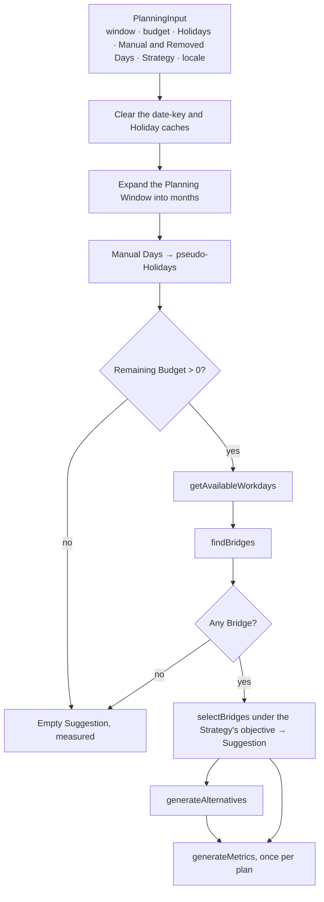
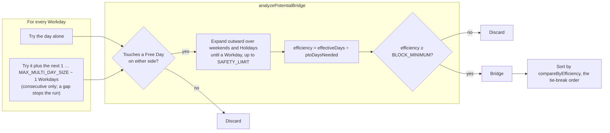
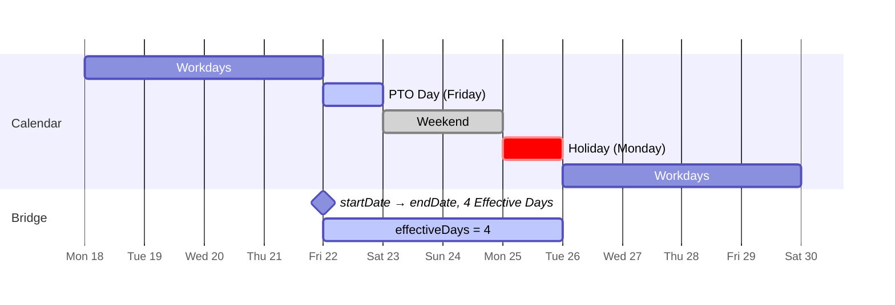
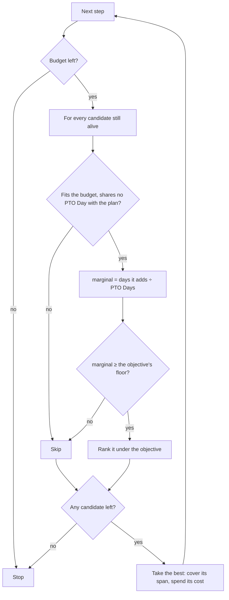

import { StrategiesTable } from '../../../components/demos/HowItWorksDemo';
import { PTO_CONSTANTS, StrategyRanking, TunablesTable } from '../../../components/demos/PlanningEngineDemo';

The engine lives in `apps/web/src/domain/calendar/` and is pure: same inputs, same output, no I/O, no clock beyond "today". `runPlanningPipeline` in `apps/web/src/domain/calendar/pipeline.ts` is the one entry point, and every stage below is a function it calls in order. The numbers in this page are interpolated from `PTO_CONSTANTS` in `apps/web/src/domain/calendar/const.ts`, so they are the values the engine runs on.

## Stage 0: the window and the budget

**The Planning Window** is the chosen year plus its Carry-over Months, expanded into one `Date` per month by `planningWindowMonths` (`apps/web/src/domain/calendar/window.ts`). A window with three Carry-over Months holds fifteen months and five Quarters; every Metric that buckets by month or Quarter sizes itself to that count, which is why a Quarter here is not a calendar quarter.

**Manual Days become Holidays before anything else runs.** Each one is appended to the Holiday list as a pseudo-Holiday with the Custom Variant and an id of `manual-N`. A Manual Day is genuinely a day the user is off, so counting it as a Free Day for Bridge expansion is correct; the same dates are also handed to the Metrics **by name**, because a Metric has to know the user paid for them. Removed Days take the opposite route: they are struck from the Workday list and never become Free Days, so a day the user has said they will work cannot anchor a Bridge.

**The budget the selector sees** is the Remaining Budget: the PTO budget less the Manual Days, measured by `measureBudget` (`apps/web/src/domain/calendar/utils/budget.ts`). When the caller passes an `autoSuggestCount` (the [worker hook](/how-it-works/calculation-worker/) does, after a manual edit) it replaces that number, so a user who took two Suggested Days back is not handed two new ones. A budget of zero, or a calendar with no candidate Bridge at all, short-circuits to an empty Suggestion that is still **measured**, so the Summary always has a real `Metrics` object to render.

## Stage 1: Workdays

`getAvailableWorkdays` in `apps/web/src/domain/calendar/utils/helpers.ts` walks every day of every month in the window and keeps a date only if it is not a weekend, not a Holiday (the pseudo-Holidays included), not a Removed Day and, unless past days are allowed, not before today. What comes out is the set of dates a PTO Day could be spent on: the candidates.

The Holiday lookups go through `createHolidaySet` and `getKey` in `apps/web/src/domain/calendar/utils/cache.ts`, which memoise the string key of every date. Those caches are **caller-owned**: the pipeline clears both on entry, so a worker instance that outlives one run cannot answer with a stale key ([ADR 0006](https://github.com/fbuireu/forever-pto/blob/main/adr/0006-caller-owned-calculation-caches.md)).

## Stage 2: Bridges

A **Bridge** is the unit the engine reasons about: a short run of consecutive Workdays that, once spent, joins the Free Days on either side into one continuous stretch. `findBridges` generates every candidate and ranks them.

1. **Generation.** For each Workday, the search tries the day alone and then runs of {PTO_CONSTANTS.BRIDGE_SEARCH.MIN_MULTI_DAY_SIZE} to {PTO_CONSTANTS.BRIDGE_SEARCH.MAX_MULTI_DAY_SIZE} consecutive Workdays starting there, so a whole working week is a single candidate. A run is only tried when every day in it is a Workday; a Holiday or a weekend in the middle ends it. Anything longer than a week is two candidates the selector joins, and the marginal gain in Stage 4 is what makes joining them worth it or not.
2. **Adjacency.** A run that touches no Free Day on either side is discarded at once. A PTO Day in the middle of a working week buys exactly one day and no stretch, and the product is not for that.
3. **Expansion.** From the run's first day backwards and last day forwards, the analyser walks over every weekend day and Holiday it meets and stops at the first Workday. The span from the first Free Day absorbed to the last is the Bridge's `startDate` to `endDate`, and its length in days is the **Effective Days**. `SAFETY_LIMIT` ({PTO_CONSTANTS.SAFETY_LIMIT}) bounds each walk; it is a guard against a malformed calendar, not a planning rule.
4. **Efficiency.** Effective Days divided by the PTO Days the run spends. A candidate under `EFFICIENCY.BLOCK_MINIMUM` ({PTO_CONSTANTS.EFFICIENCY.BLOCK_MINIMUM}) is discarded. That is the lowest floor any Strategy applies, and a Bridge can never add more to a plan than it is worth on its own, so the prune only drops candidates no Strategy could take. A lone Friday returns 3; a Thursday and Friday before a weekend return exactly {PTO_CONSTANTS.EFFICIENCY.MINIMUM}; a working week between two weekends returns 9 for 5.
5. **Ranking.** `compareByEfficiency` orders the survivors by Efficiency, and when two differ by less than `EFFICIENCY_COMPARISON_THRESHOLD` ({PTO_CONSTANTS.BRIDGE_GENERATION.EFFICIENCY_COMPARISON_THRESHOLD}) it prefers the one with more Effective Days. No Strategy reads that order as a ranking any more; it is only the last tie-break, so two equal candidates always resolve the same way.

The candidates and the Workdays are computed **once** per run, by `findPlanningCandidates` in `apps/web/src/domain/calendar/utils/candidates.ts`, and handed to both the Suggestion and the Alternatives. They used to be recomputed by each, and a Planning Window then cost two Bridge searches for one plan.

### A worked example

Take a Monday Holiday on the 25th. The Friday before is a Workday whose next day, Saturday, is free, so it passes adjacency. Expanding backwards from the Friday stops immediately (Thursday is a Workday); expanding forwards absorbs Saturday, Sunday and the Monday Holiday and stops at the Tuesday. The Bridge spans Friday to Monday: four Effective Days for one PTO Day, Efficiency 4.

The Tuesday to Friday after that Holiday form a second candidate: a four-day run whose previous day is the Holiday, expanding backwards over Monday, Sunday and Saturday and forwards over the next weekend. Nine Effective Days for four PTO Days, Efficiency 2.25: kept. Taken together with the Friday the two share the Monday Holiday, which is exactly the double count Stage 4 exists to refuse: on their own they are worth four and nine, together they are worth twelve.

## Stage 3: the Strategy

A Strategy is an **objective**, not an ordering: a marginal floor and a ranking, both read against the plan built so far. `STRATEGY_OBJECTIVE` in `apps/web/src/domain/calendar/suggestions/utils/selectors.ts` holds one per `FilterStrategy`, and a single selector, `selectBridges`, applies whichever it is given. The table is rendered from the imported `FilterStrategy` constant, so it cannot drift from the code:

<StrategiesTable />

<StrategyRanking />

- **Optimized** is the most Effective Days for the budget. It takes the Bridge that adds the most days per PTO Day, and when several add the same it takes the one whose break ends up longer, then the one farthest from the breaks already chosen. That last key is what spreads a crowd of equal Fridays across the year instead of stacking them into January.
- **Grouped** is a few long vacations. It ranks by the length of the break a Bridge ends up in, so once it holds a block it keeps growing it with the next working week, up to `GROUPED_MAX_BLOCK_DAYS` ({PTO_CONSTANTS.SELECTION.GROUPED_MAX_BLOCK_DAYS}) days. Its floor is the lower `BLOCK_MINIMUM` ({PTO_CONSTANTS.EFFICIENCY.BLOCK_MINIMUM}), because a week that extends a block adds seven days for five and would never clear Optimized's.
- **Balanced** is a break in every part of the year. It gives each quarter an equal share of the budget first, and within that share prefers the longer break, up to `BALANCED_MAX_BLOCK_DAYS` ({PTO_CONSTANTS.SELECTION.BALANCED_MAX_BLOCK_DAYS}) days, at Optimized's floor.

Over a real calendar the three sit on one axis, which the engine's own tests pin: Optimized produces the most Effective Days and the shortest breaks, Grouped the fewest and the longest, Balanced lands between them on both.

An unknown Strategy string cannot reach this table: `worker.ts` narrows the inbound value with `isFilterStrategy` and falls back to `DEFAULT_FILTER_STRATEGY`, and `objectiveFor` falls back to Grouped for the same reason.

## Stage 4: selection by marginal gain

`selectBridges` builds the plan one Bridge at a time. At every step it re-measures each remaining candidate against the days the plan already covers, and takes the best under the objective:

**The marginal gain is what the old walk lacked.** It used to rank every Bridge by the Efficiency it had on its own and walk that list once, so a Friday and the Monday after it each looked like three days for one, and the plan paid for their shared weekend twice: over a Spanish 2026 calendar it believed it had eighty Effective Days where the calendar held fifty-five. Measured against what is already covered, the Monday adds one day, falls under the floor and is left for a better one. What the selector believes it gained is now what the Metrics measure, and the engine's tests assert the two are equal.

A Bridge that would overspend is skipped, not truncated, and budget can be left unspent when nothing that remains clears the floor: a day that adds less than the floor is worse than keeping the day. The result is the sorted list of dates, the Bridges behind them and the Strategy that produced them: a **Suggestion**.

## Stage 5: Alternatives

`generateAlternatives` in `apps/web/src/domain/calendar/alternatives/generateAlternatives.ts` produces up to `maxAlternatives` (four, from the holidays store) plans that are **genuinely different** from the Suggestion and from each other:

1. The other two Strategies' plans come first, over the same candidates, when they pass the ceiling in point 4. They are the most different plans the engine can make, and the user sees what the other objectives would have done.
2. Then the chosen Strategy is re-run with one of the Suggestion's Rest Blocks taken away, largest first, and each plan found that way is itself a seed whose blocks are taken away in turn. Each run is one axis of "what if not that break?".
3. A plan is offered only when it is at least `ALTERNATIVES.MIN_DIFFERENCE` ({PTO_CONSTANTS.ALTERNATIVES.MIN_DIFFERENCE}) away from the Suggestion and from every Alternative already kept, measured as the share of their combined days they do not have in common. Distinct no longer means disjoint: an Alternative may keep the Suggestion's best Bridge and still be a different plan.
4. **No Alternative beats the Suggestion.** A plan that covers more days than the Suggestion, or more per PTO Day, is refused during the search, and the pipeline re-checks the measured Effective Days and Efficiency before handing the Alternatives out. The Suggestion is the recommendation; an Alternative is a different shape of year that gives some of it up. That is why a Grouped user is not offered the Optimized plan whenever it covers more days, which over a real calendar is every time, while an Optimized user usually is offered the Grouped one.

Every Alternative is stamped with the Strategy that found it: the other Strategies' plans carry their own, the Rest Block re-runs carry the chosen one. The Summary's notice that an Alternative adds more days compares only with the ones the chosen Strategy found, so it speaks up for a hand-edited plan that fell behind, never to tell a Grouped user that Optimized covers more. Two runs over the same inputs produce the same Alternatives, so the user's "option three" is still option three after a refresh.

## Stage 6: Metrics

`generateMetrics` in `apps/web/src/domain/calendar/metrics/generateMetrics.ts` measures a plan, and the pipeline runs it once for the Suggestion and once per Alternative. Every Metric below is defined in the [glossary](/reference/glossary/); this is how each is computed. The placed days it reads are the plan's Suggested Days with Removed Days struck and Manual Days folded in (`resolveSelectedDays`), so a hand-edited plan is measured as edited.

| Metric | Computed as |
| --- | --- |
| Effective Days | The total length of every free streak that contains a placed PTO Day: the placed days plus the weekends and Holidays they lean on, counted once each. A hand-edited plan is measured the same way, so a lone Manual Day on a Friday counts its weekend and a Bridge with one day removed keeps whatever stretch the rest of it still reaches |
| Bonus Days | Effective Days minus placed PTO Days: the stretch the budget did not pay for |
| Efficiency | Effective Days divided by placed PTO Days; zero for an empty plan |
| Gain | Effective Days beyond the **whole** budget, over that budget, as a percentage (`measureGain`). Efficiency divides by the days actually placed, Gain by the allowance, so they agree only when the budget is spent in full |
| Long Weekends | Free streaks of at least `LONG_WEEKEND_MINIMUM_DAYS` ({PTO_CONSTANTS.METRICS.LONG_WEEKEND_MINIMUM_DAYS}) days that contain a weekend and at least one placed PTO Day |
| Rest Blocks | Placed dates are sorted; a gap wider than `REST_BLOCK_SEPARATION_DAYS` ({PTO_CONSTANTS.METRICS.REST_BLOCK_SEPARATION_DAYS}) days starts a new block |
| Long Blocks per Quarter | Free streaks of at least `LONG_BLOCK_MINIMUM_DAYS` ({PTO_CONSTANTS.METRICS.LONG_BLOCK_MINIMUM_DAYS}) days with a placed day, bucketed by the Quarter their first in-window day falls in |
| Longest Vacation | The longest free streak that contains a placed PTO Day |
| Max Work Streak | The longest run of Workdays between two Free Days or placed PTO Days in the **year**, scanned from today unless past days are allowed |
| Worked Days per month | Workdays in the year minus the Holidays and PTO Days that fall on one, divided by twelve, to one decimal |
| Monthly and Quarter distribution | Placed days bucketed by window month and by Quarter, each array sized to the window |
| Bridges used | The plan's Bridges whose every PTO Day is still placed |
| First and last break | The first and last placed dates, formatted for the locale |

Two details keep the Metrics honest across a hand-edited plan. **Free streaks** (`freeStreaks` in `apps/web/src/domain/calendar/metrics/utils/streaks.ts`) scan from `STREAK_SCAN_MARGIN_DAYS` ({PTO_CONSTANTS.METRICS.STREAK_SCAN_MARGIN_DAYS}) days before the first relevant date to as many after the last, so a stretch that begins on a weekend outside the placed days is measured whole. And every Metric that reads Holidays and placed days together builds its set through one helper, `dayOffKeys` in `apps/web/src/domain/calendar/metrics/utils/dayOff.ts`, because Manual Days appear in both lists by construction and a Metric that subtracted them independently counted each one twice. `getWorkedDaysPerMonth` did exactly that once.

## The tunables

Every constant the engine reads, with its live value. The table is exhaustive over `PTO_CONSTANTS` by type, so adding or renaming a tunable in the code fails this site's typecheck until the row is written.

<TunablesTable />

## Complexity and cost

For a window of *m* months there are roughly 21·*m* Workdays; each spawns at most {PTO_CONSTANTS.BRIDGE_SEARCH.MAX_MULTI_DAY_SIZE} candidates and each candidate expands over at most a few days, so generation is linear in the window. Selection costs one pass over the candidates per Bridge taken, with the gain, the stretch and the distance kept up to date incrementally rather than recomputed. Alternatives add a bounded number of further selections. The whole run for a year is tens of milliseconds on a laptop, which is fast enough to feel instant and slow enough to stutter a slider drag if it ran on the main thread; that, and nothing about the algorithm, is why it runs in a [Web Worker](/how-it-works/calculation-worker/).

## Where to read next

- `apps/web/src/domain/calendar/AGENTS.md` is the engine's own guide: files, public API, invariants and the traps a change here falls into.
- [Holidays engine](/how-it-works/holidays-engine/) covers where the Holidays come from before this page starts.
- [Calculation worker](/how-it-works/calculation-worker/) covers the boundary the engine runs behind.
- [ADR 0003](https://github.com/fbuireu/forever-pto/blob/main/adr/0003-pure-calendar-domain-effectful-payment-domain.md) records why this context is pure while the payment one is not.
