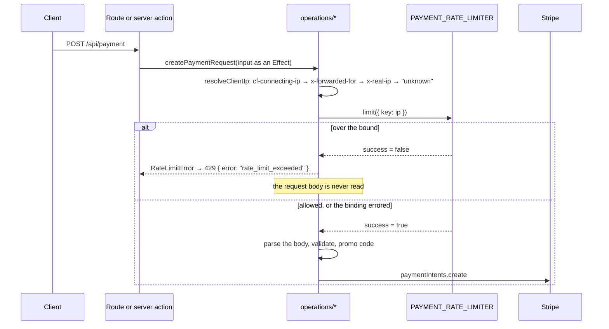

Three routes can cost money or grant Premium on an unauthenticated request: `POST /api/payment` creates a Stripe PaymentIntent, `GET /api/payment/activate` is Stripe's `return_url` and mints a session, and `POST /api/check-session` grants Premium from an email address. Each is rate-limited by client address before it does anything else. The counting is done by the platform, not the app: the source holds no limit, no window and no counter.

## How it works

1. **The binding.** `wrangler.toml` declares `[[ratelimits]]` with the binding name `PAYMENT_RATE_LIMITER`, a `namespace_id`, and `simple = { limit = 10, period = 60 }`: ten requests per key per sixty seconds. It is declared once at the top level and again in each environment, and the contract suite asserts the bounds are identical in all of them, so a preview cannot be looser than production. `period` accepts only 10 or 60; the binding is Cloudflare's [Rate Limiting API](https://developers.cloudflare.com/workers/runtime-apis/bindings/rate-limit/), which keeps the counters inside the platform.
2. **The key.** `resolveClientIp` in `apps/web/src/infrastructure/api/operations/types.ts` reads `cf-connecting-ip`, then `x-forwarded-for`, then `x-real-ip`. The order is a security decision: behind Cloudflare only the first is set by the edge, and the other two arrive from the client, so a request that could forge them can only do so when it did not come through Cloudflare at all. When none is present the limiter keys on `UNKNOWN_IP`, because a limiter needs a key, while the use case receives `null`, because a payment record should say the address is unknown rather than claim it is called "unknown". Both halves used to drift between the route and the server action; the shared operation is what settled them.
3. **The check.** `checkRateLimit(ip)` in `apps/web/src/infrastructure/services/payments/rateLimit.ts` reads the binding through `getCloudflareContext({ async: true })` and calls `.limit({ key })`. A refused request fails the Effect with a typed `RateLimitError` carrying the address.
4. **The status.** `describeFailure` in `apps/web/src/infrastructure/api/errors.ts` is the one table from tagged error to HTTP status, typed over every member of the failure union so a new error without a row is a compile error. `RateLimitError` maps to **429** with `ApiError.RATE_LIMIT_EXCEEDED` (`rate_limit_exceeded`) in the body. The browser adapters read `error` alone and never the rest of the body.

## Where it runs

The check is the **first** thing each operation under `apps/web/src/infrastructure/api/operations/` yields, before the request body is read or validated, before a promo code is looked up and before any Stripe call. That ordering is what the folder exists to own, and it is assertable because an operation takes its input as an Effect: `operations/payment.test.ts` asserts that a refused request never evaluates the body, verified by moving the limiter after the parse and watching the case go red.

| Operation | Transports | Reaches |
| --- | --- | --- |
| `createPaymentRequest` | `POST /api/payment` and the `payment` server action | Stripe, then a deferred Turso write |
| `activatePremiumRequest` | `GET /api/payment/activate` and `POST /api/check-session` | Stripe or Turso, then the session cookie |

Both transports of each operation inherit the limit whether or not they asked for one. `check-session`'s `POST` used to pass a program with no limiter at all, and it is the one an attacker would enumerate addresses against; adding the operation was what made that impossible to forget again, and it is a behaviour change: that endpoint can now answer 429 where it previously could not.

## Why not a KV counter

The first version was a read-modify-write over a KV namespace, and it did not hold. Workers KV offers neither compare-and-swap nor atomic increment, so every request whose `get` resolved before a peer's `put` landed read the same value and wrote the same number. The bound only ever held for strictly serialised traffic: two hundred parallel requests from one address, exactly the shape of card-testing traffic, advanced the counter by an amount unrelated to the burst and admitted almost all of them to `stripe.paymentIntents.create`. KV's properties widened the window rather than narrowing it: a `get` is served from a per-colo cache whose minimum TTL is sixty seconds, the length of the window, and writes to one key are throttled to roughly one per second. There is no KV namespace in the repository any more.

## What the binding guarantees, and what it does not

- **Counters are per Cloudflare location, not global.** A client whose requests land on two colos gets two counters. That is the documented behaviour of the binding, and it is acceptable here: the threat is a burst from one place, and a burst from one place hits one colo.
- **The window is not sliding to the millisecond.** The platform counts within its period at a granularity it does not promise, so a burst straddling a boundary can exceed ten. The bound is a ceiling on the order of magnitude, not an exact quota.
- **It counts requests, not outcomes.** A refused request still counts, so a client that keeps retrying a 429 stays refused.

## Fail-open by design

The binding call is wrapped in `Effect.catchAll(() => Effect.succeed(false))`: no Cloudflare context (a unit test, a Node runtime) or an unavailable binding is treated as **not** blocked. An outage of the limiter degrades to "no rate limiting" rather than "nobody can donate". That stance covers errors only, and it is a deliberate trade: the limiter is the only thing in front of the card processor, but a Donation that cannot be made is a certain loss and a burst that cannot be stopped is a possible one.

## What it is not

Two neighbours look like rate limits and are not:

- **The contact form's `DuplicateContactError`** also answers 429 (`CONTACT_ALREADY_RECEIVED`), but it is a deduplication: the same message from the same address within a window is refused as already received, which is about the content rather than the rate. It runs after validation, not before it.
- **The promotion-code redemption cap** is counted in Turso by `countPromoCodeRedemptions` and is best-effort: a race between two redemptions can admit one more than the cap. That is a marketing control, and the caveat is accepted; the payment limiter is not allowed the same slack.

## Testing

`apps/web/src/infrastructure/services/payments/rateLimit.test.ts` covers the binding call and the fail-open branch; `apps/web/src/infrastructure/api/operations/payment.test.ts` and `apps/web/src/infrastructure/api/operations/types.test.ts` cover the ordering and the address chain, including the third rung, which no test had executed before the resolver was shared. Nothing tests the platform's counting; the guarantee above is Cloudflare's.
