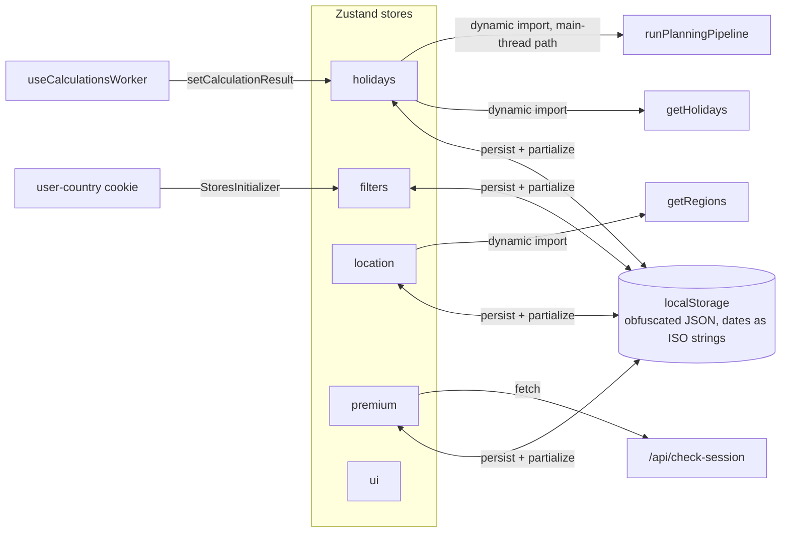

All client state lives in Zustand stores under `apps/web/src/application/stores/`. Most of them persist; each is created as `create()(devtools(persist(...)))` with a versioned storage name. The `ui` store is devtools-only. The folder's map and gotchas are in `apps/web/src/application/stores/AGENTS.md`, and the rules a store follows (`A8` to `A10`, `A12`, `A16` to `A18`) in [`CODING_STANDARDS.md`](https://github.com/fbuireu/forever-pto/blob/main/CODING_STANDARDS.md).



## Persistence: obfuscated localStorage

Persisted stores share `obfuscatedStorage` from `apps/web/src/application/stores/crypto.ts`, a `createJSONStorage` wrapper over `localStorage`:

- In production with `NEXT_PUBLIC_STORAGE_KEY` set, values are obfuscated (XOR + base64, `obfuscate`/`deobfuscate` in `apps/web/src/application/stores/utils/crypto.ts`) before hitting `localStorage`. That key ships in the client bundle, so this is obfuscation and never cryptography: it keeps casual tampering out, nothing more. See [data protection](/how-it-works/data-protection/).
- In development, or when the key is missing, it falls back to plain `localStorage`.
- On the server it is a no-op storage, so SSR never touches `localStorage`.
- Both storing branches skip a write whose value has not changed. `persist` saves the whole partialized slice on every `set`, including the ones that touch only unpersisted fields (`setCalculating`, the Alternative preview), so without the skip the holidays store would rewrite and re-obfuscate roughly 50 KB three times per calculation. The obfuscated branch remembers what it last wrote or read per key and skips a repeat only while storage still holds that blob, so another tab's write is never mistaken for its own.

Every persisted store implements the same `onRehydrateStorage` pattern: on error, log to Better Stack and `localStorage.removeItem(STORAGE_NAME)` so a corrupt blob cannot brick the app.

## Selector convention

Multi-field selections always go through `useShallow` from `zustand/react/shallow`:

```ts
const { year } = useFiltersStore(useShallow((s) => ({ year: s.year })));
```

This prevents re-renders when unrelated fields change. Stores never fetch data themselves; they delegate to `apps/web/src/infrastructure/services/*` (often via dynamic import to keep bundles lean).

## `filters` (`useFiltersStore`, storage `filters-store`)

User-facing planner configuration: `ptoDays`, `allowPastDays`, `country`, `region`, `year`, `carryOverMonths`, `strategy` (a `FilterStrategy`, defaulting to grouped; see [holidays engine](/how-it-works/holidays-engine/)), `preferredMonths` (the Preferred Months the Main Vacation Strategy builds its block in, none by default, which means any month, guarded on rehydration by `isPreferredMonths`). Quirks:

- `partialize` persists everything **except `year`**, since the year deliberately resets to the current year on every visit.
- `setCountry` resets `region` to `''`, since regions belong to a country.

## `holidays` (`useHolidaysStore`, storage `holidays-store`)

The largest store: `holidays` (the `HolidayDTO[]`), the current `suggestion`, `alternatives` (capped by `maxAlternatives`), selection/preview indexes, `manuallySelectedDays`, `removedSuggestedDays` and `isCalculating`. Key actions:

- `fetchHolidays` dynamic-imports `@infrastructure/services/holidays/getHolidays`, preserves user-created (`CUSTOM`) holidays and dedupes by date. It records `holidaysKey`, which filters the Holidays were fetched for (`holidaysKeyOf`), on success and on failure alike, and the planner plans only while that key matches the screen; the key is not persisted, so a reload waits for a fresh fetch rather than planning on the stored list. Each call also takes a sequence number and gives up if a newer call started while it awaited, so a slow answer for the previous year cannot overwrite the current one.
- `generateSuggestions` dynamic-imports `runPlanningPipeline` for the synchronous path; `setCalculationResult` is the entry point used by the [Web Worker path](/how-it-works/calculation-worker/), preserving the selected alternative index across recalculations.
- `addHoliday` / `editHoliday` / `removeHoliday` manage custom holidays, and all of them ask one predicate, `heldOn`, whether the date is already taken and by what; `toggleDaySelection` implements manual day editing with PTO-budget enforcement; `trimManualDays` supports the calendar UI. Remaining Budget comes from `measureBudget` in the calendar domain rather than from a store action.

Because `Date` does not survive JSON, `partialize` serializes every date (including nested bridge dates) to ISO strings and `onRehydrateStorage` revives them.

## `location` (`useLocationStore`, storage `location-store`)

The Country and Region option lists, `countries` and `regions`, and nothing else. The Countries are rendered on the server with `apps/web/src/infrastructure/services/countries/getCountries.ts` (built on `i18n-iso-countries`), and `CountriesClient.tsx` pushes them into the store with `setCountries` on mount. `fetchRegions(countryCode)` imports `apps/web/src/infrastructure/services/regions/getRegions.ts` only when it runs, because the Regions lookup reaches `date-holidays`, and a static import put that dataset in the first load of every page that reads the Countries. The store persists nothing: both lists are rebuilt before anything could read a stored copy, and its `migrate` drops the old blobs that still carry them.

## `premium` (`usePremiumStore`, storage `premium-store`)

Premium session mirror: `premiumKey`, `userEmail`, `lastVerified`, `needsSessionCheck` (all persisted) plus transient modal state (`modalOpen`, `currentFeature`, `isLoading`). On rehydrate, if `lastVerified` is older than 24 hours it flips `needsSessionCheck`, and `checkExistingSession()` revalidates against `GET /api/check-session` (via `apps/web/src/ui/adapters/session/checkSession.ts`). `setPremiumStatus` fires the `premium_activated` [analytics event](/how-it-works/observability/) on the move into Premium, and `confirmActivation`, which the payment confirmation page calls once while the redirect's `activation=fresh` marker is in the address, fires it for a payer the issuer redirected; a session the cookie restores, on a reload or with the store cleared, fires nothing. Details of the whole flow are on the [premium page](/how-it-works/premium/).

## `ui` (`useUIStore`, not persisted)

Ephemeral UI state: the Donate popover open/opening flags and the currency derived from the locale (`getCurrencyFromLocale`, defaults in `apps/web/src/ui/utils/currencies.ts`).
