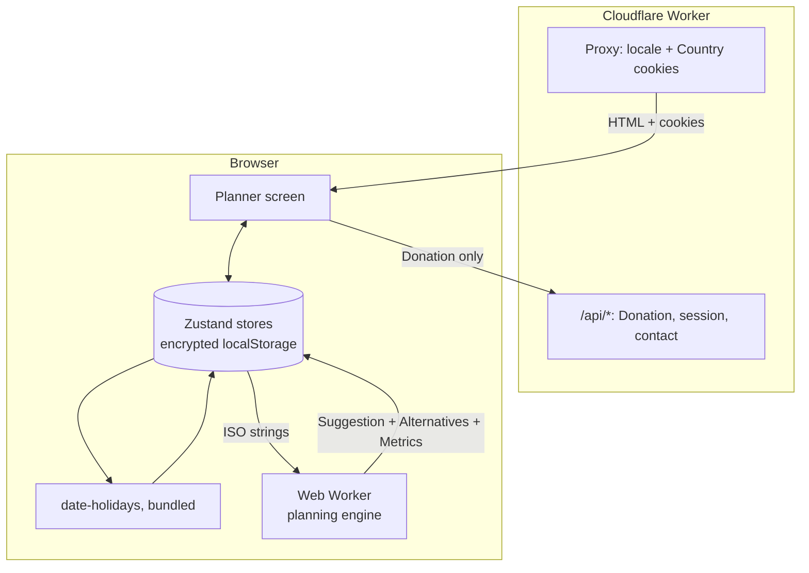

import { Card, CardGrid } from '@astrojs/starlight/components';

## The whole product in one picture

Everything that matters happens in the browser: the edge only detects a Country and serves prerendered HTML, and the plan itself never leaves the device.

<CardGrid stagger>
  <Card title='Start here' icon='rocket'>
    What the product does, the inputs it takes and the plan it returns; then how to run it locally and how the
    repository is laid out. [What the planner does →](/start/what-the-planner-does/)
  </Card>
  <Card title='How it works' icon='information'>
    One request followed from the edge to the last Metric, then every subsystem: the planning algorithm with its
    live tunables, the Holiday sources, the Web Worker, the planner screen, the stores.
    [Overview →](/how-it-works/overview/) · [The algorithm →](/how-it-works/planning-algorithm/)
  </Card>
  <Card title='Architecture' icon='open-book'>
    The layered tree under `apps/web/src/`, with the dependency graph measured from the imports rather than drawn
    from intent, the per-request proxy chain and the Effect service layer. [Overview →](/architecture/overview/)
  </Card>
  <Card title='Design system' icon='puzzle'>
    The neobrutalist component library, rendered live from the app's own sources, with props, accessibility notes
    and where each component is used. [Components →](/design-system/components/overview/)
  </Card>
  <Card title='Infrastructure & CI/CD' icon='setting'>
    Cloudflare Workers through OpenNext, one Worker per pull request, the smoke-gated release pipeline and the
    tags that keep two packages versioned apart. [Environments →](/infra/environments/)
  </Card>
  <Card title='Reference & contributing' icon='pencil'>
    The glossary the code is written in, every cookie the app sets, and the conventions, tooling and testing
    rules a change has to meet, plus how this wiki itself is built. [Glossary →](/reference/glossary/) · [How the wiki works →](/contributing/docs-site/)
  </Card>
</CardGrid>
