The app runs as a Cloudflare Worker built with OpenNext. The kinds of environment are all defined by the `[env.*]` blocks in `wrangler.toml`: previews are not a wrangler environment of their own, they are the `development` environment deployed under a different Worker name.

| Environment | Worker | URL | Access |
| --- | --- | --- | --- |
| Production | `forever-pto` | `https://forever-pto.com` (zone route `forever-pto.com/*`) | Public |
| Development (stable) | `forever-pto-development` | `https://development.forever-pto.com` | Cloudflare Access |
| Per-PR preview | `pr-<n>-forever-pto-development` | `https://pr-<n>-forever-pto-development.fbuireu.workers.dev` | Cloudflare Access |

## Production

Deployed by the `deploy-production` job of `.github/workflows/ci.yml` on every push to `main`, gated on the `Check` job passing and on the `changes` job finding an `apps/web` change (see [release](/infra/release/)). The Worker is bound to the `forever-pto.com` zone via a route pattern in `wrangler.toml`, a zone route, not a Workers custom domain. It uses the production R2 incremental-cache bucket, the rate-limiter binding and the Turso database (see [Cloudflare stack](/infra/cloudflare/)).

## Development (stable)

The `forever-pto-development` Worker is the long-lived development environment. Its custom domain (`development.forever-pto.com`) is managed in the Cloudflare dashboard: `wrangler.toml` only knows the URL as the `NEXT_PUBLIC_SITE_URL` var, there is no route for it in the file. The whole environment sits behind Cloudflare Zero Trust Access (`CF_ACCESS_*` vars in `wrangler.toml`), so a browser hitting it gets an Access login and CI must authenticate with a service token.

## Per-PR previews

Every pull request gets its own throwaway Worker.

### Created

The `deploy-development` job of `.github/workflows/ci.yml` fires on `pull_request` (`opened`, `reopened`, `synchronize`) and calls the reusable `.github/workflows/_deploy-web.yml` with `wrangler_env: development` plus a `worker_name` override of `pr-<n>-forever-pto-development`. The `--name` flag on `wrangler deploy` is what mints a brand-new Worker instead of updating the stable one, and `--secrets-file` on the same call is what gives it the five runtime secrets, which do not exist on a Worker until they are uploaded (see [secrets](/infra/secrets/)). After deploying:

1. A sticky PR comment (upserted via a hidden marker) posts the preview URL.
2. A Playwright E2E job runs against the live preview, authenticating through Cloudflare Access with a service token (`CF_ACCESS_CLIENT_ID` / `CF_ACCESS_CLIENT_SECRET` injected as `CF-Access-Client-Id/Secret` headers by `playwright.config.ts`).

### Destroyed

`.github/workflows/cleanup-development.yml` fires on `pull_request: closed` (merged or not) and runs `wrangler delete pr-<n>-forever-pto-development --force`. That single command is the entirety of teardown: the Worker and its attached secrets disappear. It queues behind the pull request's own CI run, in a concurrency group spelled from the pull request number, so the E2E job is never left driving a Worker that no longer exists; a weekly sweep deletes any preview Worker whose pull request is closed, for the cleanups something else lost.

### What survives

Previews deploy with `--env development`, so they all **share** the development bindings: the dev R2 incremental-cache bucket, the rate-limiter binding and the dev Turso database (all declared under `[env.development]` in `wrangler.toml`). None of that state is cleaned up when a PR closes, and one preview's writes are visible to every other preview.

## Lifecycle

```mermaid
flowchart TD
  subgraph pr [Pull request]
    O[opened / synchronized] --> DD[ci.yml: deploy-development]
    DD --> RW[_deploy-web.yml]
    RW --> B[cf:build, OpenNext]
    B --> W["wrangler deploy --env development<br/>--name pr-n-forever-pto-development<br/>--secrets-file"]
    W --> C[sticky PR comment with the preview URL]
    W --> E[e2e: Playwright through an Access service token]
  end
  subgraph close [Pull request closed]
    X[cleanup-development.yml, queued behind the CI run] --> DEL[wrangler delete --force]
    DEL --> GONE[Worker and its secrets gone;<br/>shared dev R2 and Turso untouched]
  end
  subgraph main [push to main]
    P[changes + Verify] --> DP[deploy-production] --> RW2[_deploy-web.yml]
    RW2 --> W2[wrangler deploy --env production] --> LIVE[forever-pto @ forever-pto.com/*]
  end
```

## The docs site's previews

This documentation site previews the same way, one Worker per pull request named `pr-<n>-forever-pto-docs-development`, deleted by its own `cleanup-docs` job when the pull request closes. What differs is what it does *not* need: no bindings, no `--secrets-file`, no `--var` override, and no second build, since it ships the `docs-dist` artifact the `build` job already produced. This section used to say the docs previews were immutable Worker versions with no teardown; they were, until both packages were aligned on the per-PR Worker model. See [docs CI](/infra/docs-ci/).
