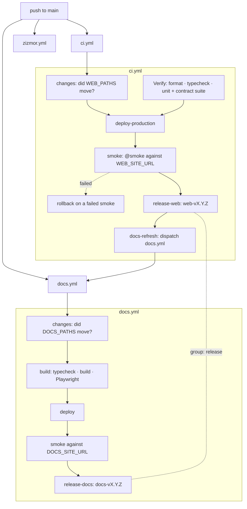

Each package releases itself. [semantic-release](https://semantic-release.gitbook.io) runs once per package, configured in `apps/web/.releaserc.json` and `apps/docs/.releaserc.json`, and [`semantic-release-monorepo`](https://github.com/pmowrer/semantic-release-monorepo) attributes a commit to a package by the paths it touches. A wiki change never cuts an app release, and an app change never cuts a wiki one.

| Package | Tags | Writes | Runs in |
| --- | --- | --- | --- |
| `apps/web` | `web-vX.Y.Z` | `package.json`, `CHANGELOG.md`, a GitHub Release | `ci.yml`, after the production deploy |
| `apps/docs` | `docs-vX.Y.Z` | a tag and a GitHub Release, nothing else | `docs.yml`, after the docs deploy |

## The flow

`release-web` verifies a `web-v*` tag exists, analyses the commits touching `apps/web`, writes `CHANGELOG.md` and the version bump, commits `chore(web): release x.y.z [skip ci]` and tags. `release-docs` does the same for `apps/docs`, and the shared `release` concurrency group is what keeps their pushes apart.

1. **A release means the version is live.** `release-web` `needs: deploy-production`, so nothing is tagged until the deploy has succeeded. `release-docs` sits behind the docs deploy and its smoke run for the same reason. Both share the concurrency group `release` with `cancel-in-progress: false`, so they queue instead of racing.
2. **Attribution is by path.** `fix:` → patch, `feat:` → minor, `BREAKING CHANGE` → major; `docs:`, `chore:`, `ci:` and friends produce no release. But the type only decides *how big* the bump is; *which* package it lands in is decided by the files the commit touched.
3. **`apps/web` runs the full plugin chain**: release notes → `CHANGELOG.md` → version bump in `package.json` (`@semantic-release/npm` with `npmPublish: false`; the package is private, only the version field matters) → a git commit of `package.json` and `CHANGELOG.md` → a GitHub Release. The lockfile is not in the asset list: it lives two levels above the package and nothing in this chain dirties it.
4. **`apps/docs` runs the same chain**, writing `apps/docs/CHANGELOG.md` and its own `package.json` version and committing both. It did not until 2026-09-12, on the theory that a second pusher raced the app's release for the branch; both jobs share the `release` concurrency group named in point 1, which is what actually serialises them, so the missing plugins bought nothing and cost eight releases whose notes lived only on GitHub beside a `package.json` reading `0.0.0`. The version is still read by nothing: the site displays the **app's**.
5. **`docs-refresh` closes the loop.** The release commit carries `[skip ci]`, so nothing would otherwise rebuild the wiki after an app version bump, and the published header would keep showing the previous one.

The `[skip ci]` marker is load-bearing: without it, the version-bump push to `main` re-triggers the whole graph.

## The bridge tag

`web-v1.8.2` sits on the same commit as the older `v1.8.2` and carries no annotation, so it reads like debris. It is not. semantic-release finds the previous release by `tagFormat`, and the app's history was written under the plain `vX.Y.Z` shape; without a tag matching `web-v*`, the next release is computed as a *first* release and published as `web-v1.0.0` over a 1.8.x line, which cannot be recalled from GitHub Releases.

`release-web` carries a step that fails the job outright when no `web-v*` tag exists, so the silent version of that failure became a loud one.

The historical plain `v*` tags are left in place and are not part of this scheme. Neither is the floating `v1` tag: nothing moves it, no ADR records it, and it diverges between local and remote, which makes semantic-release's own `git fetch --tags` fail with *would clobber existing tag*.

## Squash merge: the PR title is the commit

`main` receives squash merges, so the **PR title becomes the conventional commit** that semantic-release analyzes. Individual commit messages inside the PR are irrelevant to releasing, though `commitlint` via Husky still enforces the convention locally.

That makes squash merge load-bearing for a second reason: attribution reads the paths a commit touched, and `git diff-tree` prints nothing for a true merge commit. Enabling merge commits would make every merge release nothing, silently.

Consequences:

- **One package per pull request.** A PR spanning both packages appears in both changelogs.
- **A change confined to the repo root releases nothing**: `.github/`, `biome.json`, `adr/`, `tests/`, the root manifest.
- The old rule requiring documentation PRs to use `docs:` titles is gone, along with the matching `semanticCommitType` override in `renovate.json`. Both existed only to stop single-package versioning doing the wrong thing.

## Source files

- `apps/web/.releaserc.json`, `apps/docs/.releaserc.json` hold branches, tag formats and plugin chains.
- `.github/workflows/ci.yml` holds the `changes`, `release-web` and `docs-refresh` jobs.
- `.github/workflows/docs.yml` holds the `release-docs` job.
- `commitlint.config.ts` + `.husky/commit-msg` provide local enforcement of conventional commits.
