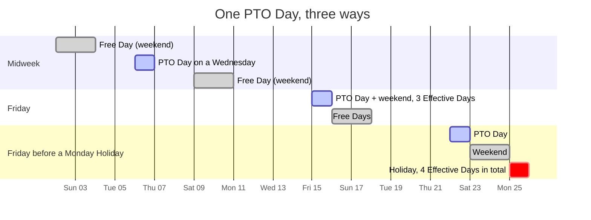
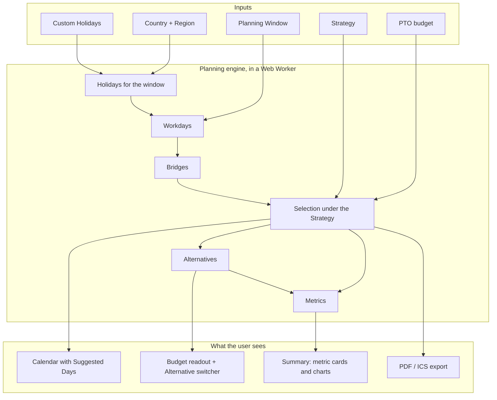

import { PTO_CONSTANTS } from '../../../components/demos/PlanningEngineDemo';

Most people spend their PTO Days one at a time, wherever a trip happens to fall. Forever PTO starts from the other end: the calendar already contains Free Days (weekends and public holidays), and a PTO Day placed **next to** them buys a longer stretch off than a PTO Day placed in the middle of a week. The product finds those placements for a whole year, ranks them, and hands back a plan the user can adjust.

The whole calculation runs in the browser. Nothing about a plan is sent to a server, there is no account to create, and the only server-side work in the product is detecting the visitor's Country, taking a Donation and sending an email.

## The problem, in numbers

One PTO Day on a Friday buys a three-day stretch away from work: the Friday plus the weekend. One PTO Day on the Friday before a Monday public holiday buys **four**. Four PTO Days between a Monday holiday and the following weekend buy **nine**. The engine calls that ratio **Efficiency** (Effective Days divided by PTO Days spent), and it discards any candidate under {PTO_CONSTANTS.EFFICIENCY.MINIMUM}, the value a lone PTO Day beside a weekend already reaches. Every rule in the engine is about raising that number across the budget while respecting the user's Strategy.

## Inputs

Everything the planner needs fits in the sidebar, and every field is a value in the [filters store](/how-it-works/state-stores/):

| Input | Glossary term | Where it comes from |
| --- | --- | --- |
| Country | Country | Detected from the request on the first visit and written to the `user-country` cookie ([country detection](/how-it-works/country-detection/)); the user can override it |
| Region | Region | Optional. The list is derived from the Holiday calendar of the chosen Country ([data sources](/how-it-works/data-sources/)) |
| Year and Carry-over Months | Planning Window | The year defaults to the current one and is never persisted; Carry-over Months extend the window past December so this year's budget can be spent in the next |
| PTO budget | PTO Day | A number of days. Two calculators in the sidebar help find it: accrual by months worked, and the salary value of unspent days |
| Strategy | Strategy | Grouped, Optimized or Balanced; see [the planning algorithm](/how-it-works/planning-algorithm/) |
| Allow past days | Workday | Whether dates already behind today may receive a PTO Day |
| Custom Holidays | Custom Holiday | Company closures or local festivities the user adds, edits or removes in the Holidays table; they survive every refetch |

## What comes back

A **Suggestion**: the set of dates to spend the budget on, the Bridges that motivated each of them, and a block of Metrics that describes the result. Beside it, up to four **Alternatives**, each a genuinely different plan for the same inputs, that the user can preview on the calendar and apply with one click.

The Metrics answer the questions a user asks of a plan: how many Effective Days did the budget buy, how many Bonus Days came free, how many Long Weekends and Rest Blocks it produced, the Longest Vacation, the Max Work Streak left standing, and how the time off distributes across months and Quarters. The [Summary](/how-it-works/planner-ui/#summary) renders them as cards and charts.

## What the user can do with it

- **Edit the plan by hand.** Clicking a Workday spends a PTO Day on it (a Manual Day); clicking a Suggested Day takes it back (a Removed Day). Manual Days survive every recalculation, Suggested Days do not; the [holidays store](/how-it-works/state-stores/) enforces the budget and refuses a click on a weekend, a Holiday or an exhausted budget with a reason the calendar turns into a toast.
- **Compare Alternatives.** Stepping through the Alternatives in the panel previews each one on the calendar; applying one makes it the Suggestion.
- **Correct the calendar.** Add, edit or delete Holidays, including the national ones the data source got wrong for this user's employer.
- **Take it away.** Export the plan as a PDF or as an ICS file that imports into any calendar client ([exports](/how-it-works/exports/)).
- **Ask what a period costs.** The Workday counter in the sidebar counts Workdays and Holidays in any range.

Manual editing, Custom Holidays, Carry-over Months, past days, the advanced Metrics and the exports are Premium, which a one-time Donation unlocks ([premium](/how-it-works/premium/)). The planner itself, the Suggestion and the Alternatives are free.

## Where it runs

The engine is a set of pure functions under `apps/web/src/domain/calendar/`, with no framework, no I/O and no clock beyond "today". The planner runs it inside a **Web Worker** (`apps/web/src/infrastructure/workers/worker.ts`) so a slider drag never freezes the calendar, and state lives in encrypted `localStorage` through Zustand. Because the planner never sends the plan anywhere, a PTO plan is private by construction; see [ADR 0001](https://github.com/fbuireu/forever-pto/blob/main/adr/0001-planner-runs-in-the-browser.md) for the trade-offs that decision carries.

The [How it works](/how-it-works/overview/) section follows a request from the first byte to the last Metric.
